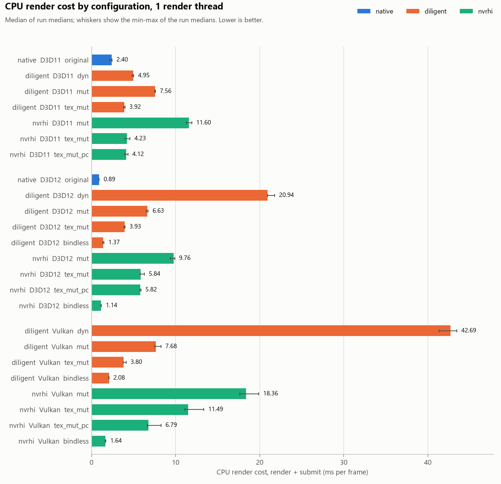
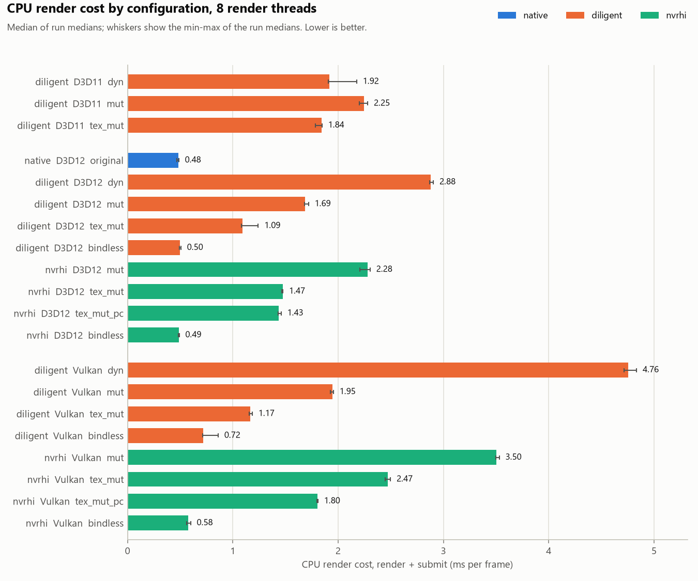
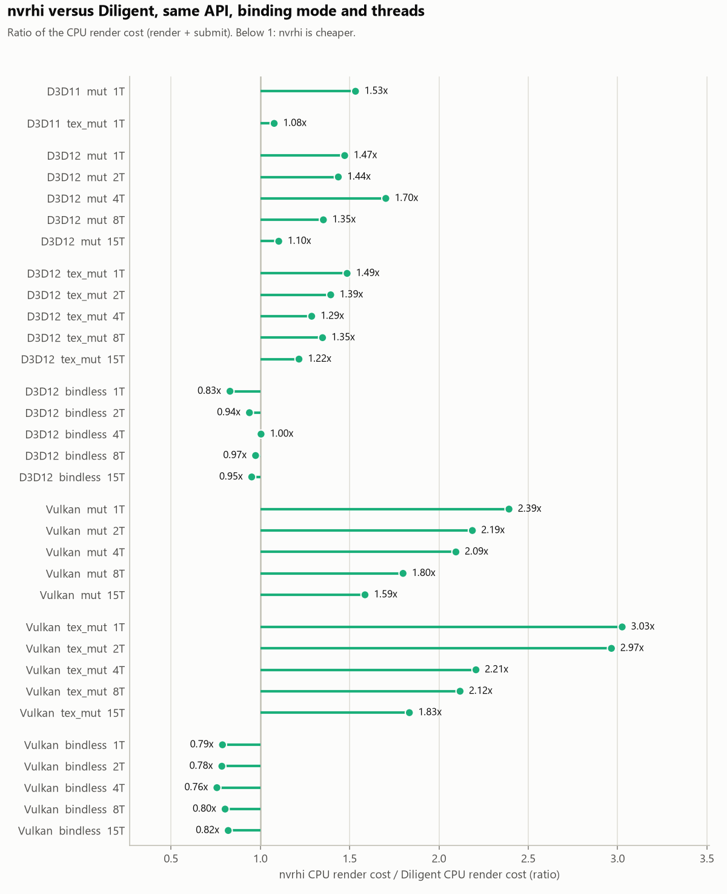
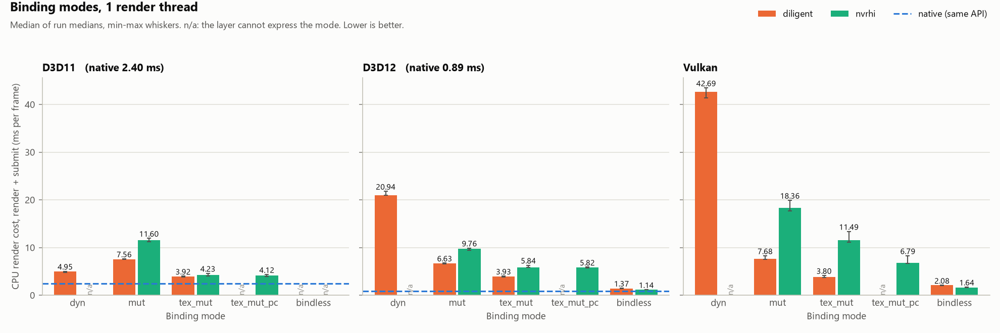
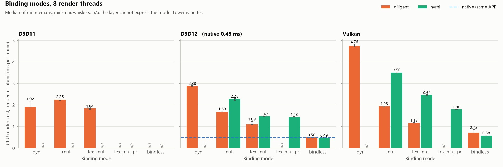
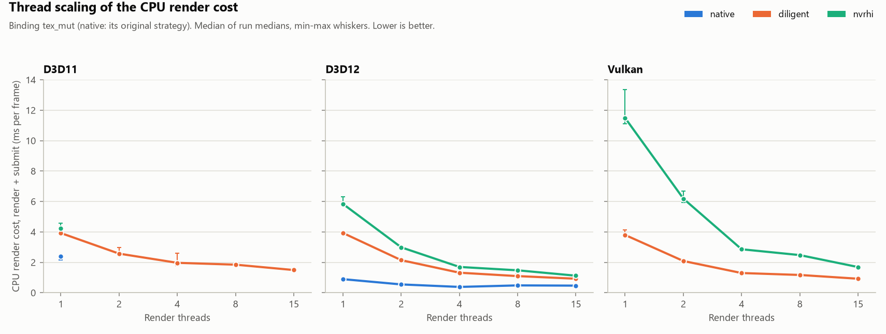
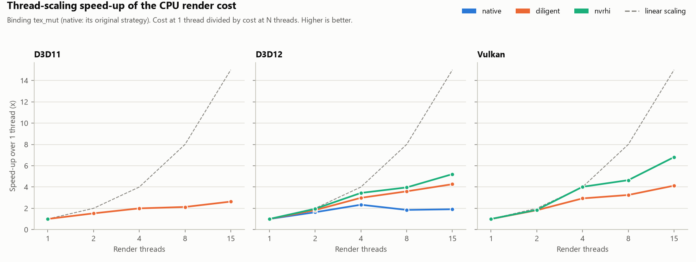
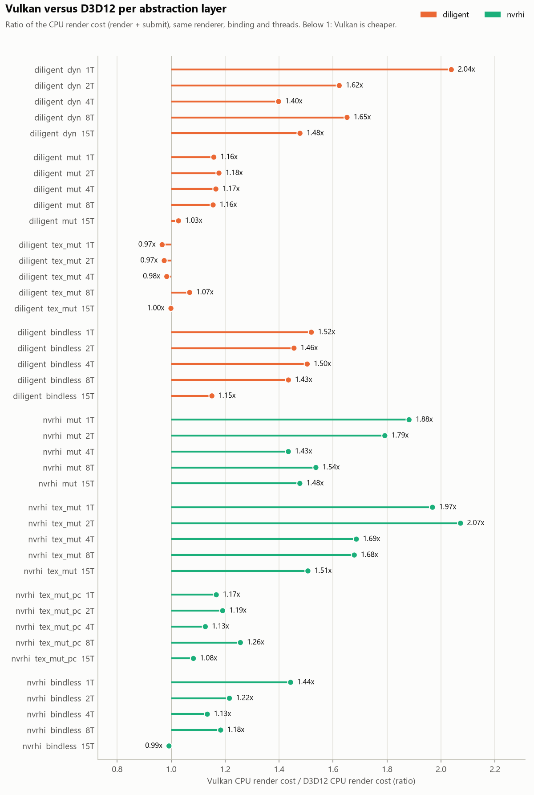
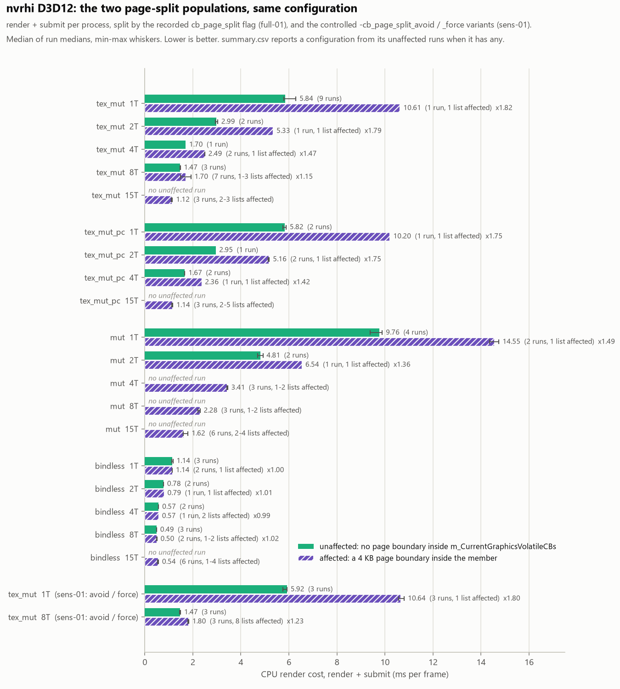
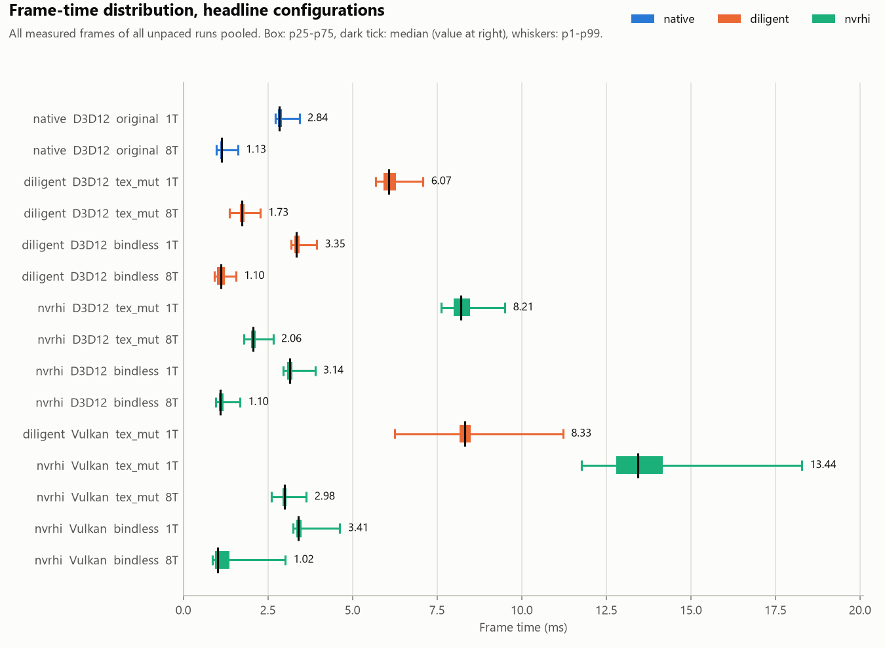

# CPU overhead of nvrhi (Donut) against DiligentCore and native D3D11/D3D12 on the Asteroids workload

Performance analysis report. Measurement session `full-01` (2026-09-30 14:41 UTC to 2026-10-01 00:22 UTC),
auxiliary sessions `gpu-01`, `half-01`, `cover-01` (CPU-bound check), `sens-01` (nvrhi switches),
`profiles-01` (CPU sampling). Every number in this document comes from the files listed in Appendix B;
medians are quoted with the min–max range of the run medians in brackets, and a difference is only called
real when the two ranges do not overlap.

**Reading guide.** `render + submit` is the CPU cost of recording and submitting one frame of 50,001 draws on
the main thread (ms per frame, or ns per draw). `native` is the hand-written D3D12/D3D11 renderer of the
Diligent Asteroids sample. The two abstraction layers are compared with native in two different ways
(section 3.4): only `bindless` uses the same binding strategy as native D3D12, so only `bindless` versus
native is layer overhead; `tex_mut`/`mut`/`dyn` switch a binding per draw and their distance to native is
the cost of that binding model.

## 1. Summary of findings

1. **With bindless binding, nvrhi D3D12 costs 27 % more CPU than native D3D12 at 1 thread (1.137 ms
   [1.125–1.171] against 0.892 ms [0.889–0.924]; +4.9 ns/draw), Diligent 53 % (1.369 ms [1.364–1.476];
   +9.5 ns/draw).** At 2 and 4 threads both layers are 43–52 % above native (+3.8 to +5.7 ns/draw); at 8
   and 15 threads native is GPU-bound (`gpu_ms / frame_ms` 0.99) and the comparison is void. nvrhi is the
   cheaper layer in every bindless pairing where the ranges separate: D3D12 0.83x Diligent at 1 thread,
   0.94x at 2, 0.97x at 8; Vulkan 0.76–0.82x at every thread count (ranges overlap only at 4 threads, one
   outlier run on each side) (section 4.3).
2. **With per-draw binding-set switches and a volatile constant buffer (`tex_mut`), nvrhi costs 1.49x
   Diligent on D3D12 (5.838 ms [5.798–6.292] against 3.929 ms [3.869–4.002] at 1 thread; 1.22–1.39x at
   2–15 threads) and 3.03x on Vulkan (11.492 ms [11.093–13.366] against 3.798 ms [3.754–4.128];
   1.83–2.97x at 2–15 threads).** With one binding set per draw (`mut`) the ratios are 1.47x (D3D12) and
   2.39x (Vulkan). The whole D3D12 difference is nvrhi's own CPU work in `setGraphicsState` /
   `setGraphicsBindings` (+38 ns/draw: state-struct copies, a 776-byte `static_vector` rebuilt and copied per
   state change, three hash-map lookups per draw); the D3D12 runtime and driver cost the same for both layers
   (section 5).
3. **On nvrhi Vulkan, push constants instead of a volatile constant buffer remove 41 % of the `tex_mut`
   cost at 1 thread (6.793 ms [6.642–8.276] against 11.492 ms) and 27–43 % at 2–15 threads.** On D3D12
   the two paths cost the same (0.97–1.02x, inside the spread). The Vulkan gap (+94 ns/draw measured; the
   profiled components below sum to 113) is the volatile-buffer write itself (31 ns), a descriptor-set rebind
   with a dynamic offset on every draw instead of only on texture changes (+33 ns nvrhi side, +8 ns driver)
   and +41 ns inside `vkCmdDrawIndexed` [driver cost, attribution inferred] (section 5.2).
4. **nvrhi D3D12 has two per-process cost levels caused by a 4 KB page boundary falling inside one member
   of its `CommandList` object.** When the heap places the object so that `m_CurrentGraphicsVolatileCBs`
   (776 bytes) straddles a page — 48 of 256 placements, 19 % — every `setGraphicsState` that changes a
   binding set costs about 80 ns more: `tex_mut` at 1 thread 10.638 ms [10.568–10.803] with the boundary
   forced against 5.919 ms [5.756–5.922] with it avoided (1.80x, `sens-01`); 1.82x in the uncontrolled
   `full-01` runs. Each recording thread has its own list, so the share of affected processes grows with the
   thread count (expected from the 19 % per list: 81 % at 8 threads, 96 % at 15; observed in `full-01`: 12 of
   21 nvrhi D3D12 runs at 8 threads, 18 of 18 at 15) while the per-process penalty shrinks (1.23x at 8 threads
   with all 8 lists affected). `bindless` is unaffected (1.00x). It is a placement accident inside nvrhi, not a
   property of the API or driver; Diligent and native show no second level (section 4.7).
5. **Thread scaling of `render + submit` at 8 threads (`tex_mut`): nvrhi D3D12 3.96x (5.838 to 1.474 ms),
   Diligent D3D12 3.59x (3.929 to 1.093 ms), nvrhi Vulkan 4.64x, Diligent Vulkan 3.25x; native D3D12 stops
   scaling at 4 threads (2.34x, 0.382 ms) because the GPU becomes the limit.** nvrhi's higher ratio is the
   arithmetic of a larger per-draw cost over a similar serial part (0.09–0.18 ms per frame for all three
   renderers): in absolute terms nvrhi stays the most expensive at every thread count (section 4.5, 5.4).
6. **Vulkan costs more CPU than D3D12 in nvrhi, not in Diligent `tex_mut`.** nvrhi Vulkan / D3D12:
   `tex_mut` 1.97x at 1 thread (1.51–2.07x across thread counts), `bindless` 1.44x at 1 thread and
   1.13–1.22x at 2–8, `tex_mut_pc` 1.08–1.26x. Diligent `tex_mut` 0.97–1.07x (inside the spread, i.e. the
   same), Diligent `bindless` 1.43–1.52x at 1–8 threads (1.15x at 15). On Vulkan `tex_mut` nvrhi's own code is
   137 ns/draw against Diligent's 35; about 76 ns/draw of it (profiled; 56 in `tex_mut_pc`) are four
   cached-state resets per `setGraphicsState` (`vulkan-graphics.cpp:658-661`) that the D3D12 backend does not
   do (section 5.2).
7. **Of the nvrhi switches, only `trackLiveness` matters: leaving it at nvrhi's default (`true`) doubles the
   D3D12 `tex_mut` cost at 1 thread (11.507 ms [11.385–11.629] against 5.817 ms [5.769–5.866], 1.98x) and
   adds 44 % at 8 threads; on Vulkan +14 % / +5 % (+13 % with the garbage collection).** `-always_set_state`
   (no redundant-binding filter in the application) costs 2–4 %, `-no_auto_barriers` saves 4 % on Vulkan at
   8 threads and nothing resolvable elsewhere (section 4.8).
8. **Measurement quality.** 104 configurations, 481 runs, all `ok`, the same scene hash
   `0x95bca375014e86d9` in every run; no thermal drift (every later repetition round was *faster* than the
   first: the median over the configurations of a round's run against the first-round run of the same
   configuration is 0.95–0.99, i.e. 1–5 % faster). 37 configurations have a min–max spread above 5 %, almost
   always one or two slow outlier runs (the slowest run of a configuration is a first-round run in 39 of 104
   configurations); the extra repetitions added for 39 configurations moved the median by less than 2 % in
   30 of them and by 2.1–10 % in the other 9 (Appendix A lists every spread). A 12–14 % background CPU load
   (a proxy client and its WebView2 processes) was present throughout; it is a constant term that matters
   most at 15 threads (section 6).

## 2. Test setup

### 2.1 Machine, drivers, OS

| Item | Value (`results/full-01/environment.json`, `docs/ENVIRONMENT.md`) |
|---|---|
| CPU | AMD Ryzen 7 8845HS, 8 cores / 16 logical processors, max 3801 MHz; laptop, 31.3 GB RAM |
| Benchmark GPU | NVIDIA GeForce RTX 4050 Laptop GPU (`10de:28a1`), driver 32.0.16.1047 (2026-05-19), Vulkan API 1.4.341, DXGI LUID 96800, pinned by LUID in every run |
| Other GPU | AMD Radeon 780M (`1002:1900`), driver 32.0.31041.1004; it drives the 120 Hz panel, so every windowed present of the RTX 4050 goes through the desktop compositor |
| OS | Windows 10 Pro 22H2, build 19045.7725 |
| Power | plan "Balanced" (`381b4222-…`), AC line online; recorded, not enforced; nothing pins threads or priorities |
| Toolchain | Visual Studio 2022 Community (MSBuild 17.14), Windows SDK 10.0.19041.0, CMake 4.3.1, PowerShell 5.1 |
| Desktop | display on, session unlocked, window topmost in benchmark mode; `full-01` and `sens-01` with the window displayed, `gpu-01`, `half-01`, `cover-01` with the window covered (`-CoverWindow`) |

Background load: during all sessions a proxy client (`clash-verge.exe`, `clash-verge-service.exe`,
`verge-mihomo.exe`) and twelve `msedgewebview2.exe` processes were running (process list of the ETW traces in
`results/profiles-01`); the measurement agent observed a steady 12–14 % total-CPU load from them. The load
figure is not recorded in the session files.

### 2.2 Commits and binaries

| Repository | Commit | Note |
|---|---|---|
| root (`nvrhi-benchmark`) | `4fc06d85` | branch `main`, clean |
| Donut (fork `HuazyYang/Donut`) | `62eab21d` | branch `ethereal-dev`; only `.gitignore` modified |
| nvrhi (fork `HuazyYang/NVRHI`, `Donut/nvrhi`) | `c8d34b4f` | branch `lithereal-dev`, clean |
| DiligentEngine | `e24e7194` | `master`; `DiligentSamples` pointer modified (local branch below) |
| DiligentCore | `bcb8b11e` | clean |
| DiligentSamples | `9a33df91` | local branch `nvrhi-benchmark` = upstream `7c96699` + `patches/diligent-samples-asteroids.patch` |

Executables (SHA-256 recorded per session, identical in `full-01`, `gpu-01`, `half-01`, `cover-01`, `sens-01`):
`asteroids_reference.exe` `1D1D253C…`, `asteroids_nvrhi.exe` `B90AEAF5…`. No rebuild from the recorded commits
was made to prove that these binaries correspond to them (section 6).

### 2.3 Build flags

Both executables and all statically linked libraries: `/O2 /Ob2 /Ot /Oi /arch:AVX2 /GL /GF`, link
`/LTCG /DEBUG:FULL /OPT:REF /OPT:ICF /INCREMENTAL:NO`, single configuration Release, VS 17 2022 x64. The only
difference: the reference executable and Diligent are built with `/GR-`, `asteroids_nvrhi`/Donut/nvrhi keep
RTTI (nvrhi's validation layer and Donut's scene graph use `dynamic_cast`; not on the benchmark path). Shader
toolchains differ (native: FXC at build time; Diligent: d3dcompiler/glslang at run time; nvrhi: ShaderTool with
d3dcompiler for D3D11, DXC 6_5 DXIL for D3D12, DXC SPIR-V for Vulkan). Details: `docs/BUILD.md`.

### 2.4 Workload

The Diligent Asteroids sample in benchmark mode: 50,000 asteroids (50,001 draws per frame including the
skybox), 1000 meshes, 10 textures, 1080 x 720 windowed, vsync off, no GUI sprites or text, fixed simulation
timestep 1/60 s, seed 1337, `static_scene_hash 0x95bca375014e86d9` identical in all 481 runs. Every run is a
fresh process: 5 s warm-up, 20 s measured. The simulation update runs on the same worker threads and is
outside the headline metric.

### 2.5 The three renderers and what "native" means

| Renderer | Executable | What it is |
|---|---|---|
| `native` | `asteroids_reference.exe` | the sample's hand-written D3D11 and D3D12 renderers. Native D3D12 binds all 10 textures as one descriptor table once per command list, selects the texture in the pixel shader, writes two matrices per draw into a persistent per-frame upload array and issues one root CBV + one draw per asteroid; `-binding` is ignored and recorded as `original`. In benchmark mode it differs from the stock sample in three deliberate ways: persistent worker threads (the Diligent renderer's scheme instead of `parallel_for`), static geometry in a DEFAULT heap (the stock UPLOAD heap made it GPU-bound at 2.4 ms per frame) and a tearing swap chain (`docs/LIMITATIONS.md` 2.9). Native D3D11 sets one SRV per draw and is single-threaded. |
| `diligent` | `asteroids_reference.exe` | the sample's DiligentCore renderer, stock code, D3D11 / D3D12 / Vulkan; deferred contexts for multi-threading; `CommitShaderResources` before every draw, dynamic constant buffer mapped with DISCARD per draw. |
| `nvrhi` | `asteroids_nvrhi.exe` | a new renderer on Donut + nvrhi (`src/nvrhi/`), D3D11 / D3D12 / Vulkan, written as a competent nvrhi application for this workload: permanent resource states, `trackLiveness = false`, 1 MB upload chunks, a redundant-binding-set filter in the application (about 90 % of the draws still change the set with 10 random textures), automatic barriers on, one volatile constant buffer per thread (`docs/LIMITATIONS.md` 4). |

All multi-threaded renderers use the main thread plus N-1 persistent workers, `ceil(50,000 / N)` asteroids per
subset, worker wake-up and join inside `render_ms`; native D3D11 and nvrhi D3D11 are single-threaded only.

## 3. Methodology

### 3.1 Metrics

All columns are main-thread wall-clock milliseconds per frame (`frames.csv`), medians over the measured frames
of a run, then the median of the run medians per configuration; the min–max range and `spread = (max - min) /
median` are over the run medians. p1/p99 are the medians of the per-run p1/p99 over frames.

| Column | Definition |
|---|---|
| `render_ms` | start of command recording until every command list is recorded (workers joined) |
| `submit_ms` | closing and executing/submitting the command lists |
| **`cpu_render_ms`** | **`render_ms + submit_ms`: the headline metric ("CPU render cost")** |
| `ns_per_draw` | `cpu_render_ms x 1e6 / 50,001` |
| `present_ms` | the Present call |
| `wait_ms` | blocking on GPU fences / frame pacing; contains `gc_ms` for nvrhi |
| `gc_ms` | nvrhi's per-frame garbage collection (Donut's `runGarbageCollection`); 0 for the others |
| `frame_ms` | start of frame N to start of frame N+1 (secondary metric) |
| `gpu_ms` | GPU timestamp span of the frame; only from the `-gpu_timing` session |
| `render + submit + present` | sensitivity metric: Diligent and native D3D11 replay deferred work inside Present; on nvrhi Vulkan it also contains a GPU wait |
| `render + submit + gc` | sensitivity metric: nvrhi releases command-list references in the garbage collection |

Work done by worker threads is visible only through the main thread's wait for them; CPU time summed over
threads is not measured.

### 3.2 Protocol

- Matrix: {native, diligent, nvrhi} x {d3d11, d3d12, vk} x applicable bindings x threads {1, 2, 4, 8, 15} =
  104 configurations. One protocol for every run: 5 s warm-up + 20 s measured, fresh process, 10 s cool-down.
- Repetitions: headline set (D3D12 and Vulkan, `tex_mut` and `bindless`, plus native D3D12; 1 and 8 threads)
  5, all others 3; after the first pass the runner was resumed with the repetitions raised to 10 / 6 for 39
  configurations (`runs` column of Appendix A). Order: repetition rounds, configurations shuffled inside each
  round with seed 20260930 (randomized, interleaved).
- The runner keeps the display awake, refuses to run with the display off or the session locked, records
  the desktop state and `window_visible_fraction` of every run, and pins the adapter by LUID.
- Analysis: `scripts/analyze.py` (definitions in its docstring), output in `report/data`.

### 3.3 What is excluded, and how

- **GPU-timed runs** (`gpu-01`): the timestamp queries sit inside the timed columns, so these runs feed only
  `gpu_ms` and the CPU-bound check.
- **Paced runs**: a run whose median `frame_ms` sits within 2 % of a multiple of the 120 Hz refresh period
  while render work fills at most 95 % of the frame and `wait + present` absorbs the slack (correlation
  <= -0.4) is paced by the desktop compositor. Such runs are excluded from `frame_ms`, `present_ms`,
  `wait_ms`, `render + submit + present` and the CPU-bound check and stay in `render + submit`. In `full-01`
  this is 77 runs, all Diligent Vulkan: every run at >= 2 threads except `dyn` at 2 and 4 threads (whose
  frame times, 19.2 and 8.9–9.1 ms, are not near a refresh multiple), all 5 `bindless` runs at 1 thread and
  9 of the 10 `tex_mut` runs at 1 thread (`validation.json`). DiligentCore selects MAILBOX when the surface
  offers it and `SwapChainDesc` has no present-mode field, so the sample cannot ask for IMMEDIATE; a displayed
  MAILBOX window gets one frame per refresh. Donut's nvrhi Vulkan uses IMMEDIATE and is not paced. Paired
  paced/unpaced runs differed by 2–7 % in `render + submit` without a common sign (`docs/LIMITATIONS.md`
  3.1), so Diligent Vulkan `render + submit` differences below about 7 % are not quoted as findings.
- **Pacing mis-flag**: `diligent_vk_tex_mut_t01` rep1 (frame 8.330 ms, the refresh period) was not flagged
  (9 of 10 runs were). The `frame_ms` 8.33 ms of this configuration in `summary.csv` and in the frame-time
  chart is the compositor's; its unpaced frame time is 6.04 ms (`cover-01`, section 3.5).
- **nvrhi D3D12 page-split populations**: every nvrhi D3D12 run records whether a page boundary lies inside
  the command list's volatile-constant-buffer state; the two populations are never pooled. A configuration
  is reported from its unaffected runs when it has any (`population` column); where every run is affected
  (`mut` 4/8/15 threads, `tex_mut` 15, `tex_mut_pc` 15, `bindless` 15) the row is the affected population
  and thread-scaling statements for those use the controlled `sens-01` variants instead (section 4.7).

### 3.4 Binding modes

| Mode | Diligent | nvrhi | Versus native |
|---|---|---|---|
| `dyn` | one SRB, dynamic texture variable changed per draw | N/A: binding sets are immutable | binding-model cost |
| `mut` | 50,000 SRBs | 50,000 binding sets | binding-model cost |
| `tex_mut` | 10 SRBs + dynamic constant buffer (DISCARD per draw) | 10 binding sets + volatile constant buffer per draw | binding-model cost; headline comparison nvrhi vs Diligent |
| `tex_mut_pc` | N/A | 10 binding sets + push constants (160 bytes per draw) | binding-model cost |
| `bindless` | bindless (D3D12/Vk only) | descriptor table + per-instance structured buffer (D3D12/Vk only) | **layer overhead with equivalent binding strategy** |

N/A combinations are not scheduled: native Vulkan, Diligent `tex_mut_pc`, nvrhi `dyn`, `bindless` on D3D11,
more than one thread for native D3D11 and nvrhi D3D11. For Vulkan rows native D3D12 is a cross-API reference
only (it mixes API, driver and layer). On D3D11 both the native renderer and the layers bind one texture per
draw, so the D3D11 rows are labelled "layer overhead, per-draw texture binding on both sides".

### 3.5 CPU-bound check

Two covered-window sessions of the 18 headline configurations: `gpu-01` (`-gpu_timing`, `gpu_ms / frame_ms`)
and `half-01` (540 x 360; a CPU-bound frame time does not change). Reference frame times from `cover-01`
(same configurations, covered window, no pacing). Source: `report/cover/data/cpu_bound_check.csv`
(`report/data/cpu_bound_check.csv` mixes covered and displayed sessions and is not used).

| Configuration | frame (ms, cover-01) | gpu / frame | half-res frame / full | half-res render+submit / full | Verdict |
|---|---:|---:|---:|---:|---|
| native D3D12 1T | 3.05 | 0.36 | 1.00 | 1.01 | CPU-bound |
| native D3D12 8T | 1.13 | **0.99** | 0.98 | 0.80 | **GPU-bound** |
| Diligent D3D12 tex_mut 1T / 8T | 6.49 / 1.90 | 0.18 / 0.62 | 0.98 / 0.98 | 0.98 / 0.97 | CPU-bound |
| Diligent D3D12 bindless 1T / 8T | 3.61 / 1.18 | 0.19 / 0.59 | 0.99 / 0.94 | 0.99 / 0.97 | 1T CPU-bound; 8T near the limit (6 % frame drop) |
| nvrhi D3D12 tex_mut 1T / 8T | 8.64 / 2.53 | 0.31 / 0.47 | 1.01 / 0.90 | 1.01 / 0.87 | 1T CPU-bound; 8T flagged (10 % frame drop from 2 half-res runs) — the render+submit of those runs dropped by the same 13 %, so the drop is a page-split-population difference between the sessions rather than a GPU limit [inferred; cover-01's 8T runs are all page-split affected] |
| nvrhi D3D12 bindless 1T / 8T | 3.36 / 1.16 | 0.31 / 0.76 | 1.00 / 1.00 | 1.01 / 1.01 | 1T CPU-bound; 8T near the limit |
| Diligent Vulkan tex_mut 1T / 8T | 6.04 / 1.71 | 0.22 / 0.72 | 1.00 / 0.98 | 1.00 / 0.98 | CPU-bound |
| Diligent Vulkan bindless 1T / 8T | 4.14 / 1.17 | 0.19 / 0.79 | 1.00 / 0.94 | 0.99 / 0.91 | 1T CPU-bound; 8T near the limit (6 %) |
| nvrhi Vulkan tex_mut 1T / 8T | 15.53 / 3.17 | 0.31 / 0.52 | 1.03 / 0.99 | 1.00 / 0.99 | CPU-bound |
| nvrhi Vulkan bindless 1T / 8T | 3.70 / 1.08 | 0.26 / 0.82 | 0.98 / 0.96 | 0.98 / 0.93 | 1T CPU-bound; 8T near the limit (4 %) |

All 1-thread rows and the 8-thread `tex_mut` rows are CPU-bound. Native D3D12 at 8 threads is GPU-bound;
its `render + submit` rises from 0.382 ms at 4 threads to 0.482 ms at 8, plausibly because the main thread
is descheduled in the pacing wait between frames and loses cache and frequency state [inferred, not
measured; `docs/LIMITATIONS.md` 3]. The `bindless` 8-thread rows sit at 0.59–0.82 of the GPU limit with 0–6 %
frame drops at half resolution; their `render + submit` is still CPU work, but frame times there describe
the pacing scheme as much as the layer.

Covered-window sessions are systematically slower in `render + submit` than the displayed `full-01` (ratios
0.98–1.17 over the 17 configurations whose runs come from the same page-split population in both sessions,
median about 1.09; e.g. nvrhi Vulkan `tex_mut` 1T 13.46 against 11.49 ms; the 18th, nvrhi D3D12 `tex_mut`
8T, has only affected runs in `cover-01`); the cause was not investigated. Covered-session numbers are
therefore compared only among themselves and never mixed with `full-01` numbers.

### 3.6 Parity evidence

Frame 30 captured by all five D3D12/Vulkan renderers at 8 threads (`report/parity/parity.txt`): identical
`static_scene_hash 0x95bca375014e86d9` and `capture_dynamic_scene_hash 0x6388bee9ee979c5c`; the three D3D12
images differ by at most 2/255 in any channel with 0.000 % of pixels differing by more than 8, the two Vulkan
images are identical, D3D12 against Vulkan differs in 0.001 % of the pixels (max 12/255; sampler/toolchain
differences, `docs/LIMITATIONS.md` 2.7–2.8). The renderers draw the same frames.

## 4. Results

### 4.1 CPU render cost per configuration





**1 render thread** (median of run medians; min–max; p1/p99 of the per-frame values; `frame_ms` where valid):

| Renderer | API | Binding | render+submit (ms) | min–max | ns/draw | p1 / p99 | frame (ms) | Population |
|---|---|---|---:|---|---:|---|---:|---|
| native | D3D11 | original | 2.401 | 2.139–2.443 | 48.0 | 2.30 / 3.26 | 4.33 | |
| diligent | D3D11 | dyn | 4.953 | 4.820–5.024 | 99.1 | 4.39 / 6.61 | 7.13 | |
| diligent | D3D11 | mut | 7.565 | 7.519–7.613 | 151.3 | 7.04 / 11.27 | 9.56 | |
| diligent | D3D11 | tex_mut | 3.924 | 3.812–3.986 | 78.5 | 3.60 / 5.52 | 6.08 | |
| nvrhi | D3D11 | mut | 11.596 | 11.256–11.926 | 231.9 | 10.76 / 16.40 | 13.59 | |
| nvrhi | D3D11 | tex_mut | 4.229 | 3.989–4.588 | 84.6 | 3.66 / 8.04 | 6.39 | |
| nvrhi | D3D11 | tex_mut_pc | 4.120 | 3.966–4.335 | 82.4 | 3.77 / 5.46 | 6.25 | |
| native | D3D12 | original | 0.892 | 0.889–0.924 | 17.8 | 0.85 / 1.13 | 2.82 | |
| diligent | D3D12 | dyn | 20.944 | 20.936–21.790 | 418.9 | 17.28 / 23.38 | 23.26 | |
| diligent | D3D12 | mut | 6.628 | 6.530–6.739 | 132.6 | 5.91 / 9.04 | 8.69 | |
| diligent | D3D12 | tex_mut | 3.929 | 3.869–4.002 | 78.6 | 3.76 / 4.50 | 6.08 | |
| diligent | D3D12 | bindless | 1.369 | 1.364–1.476 | 27.4 | 1.30 / 1.65 | 3.34 | |
| nvrhi | D3D12 | mut | 9.759 | 9.384–9.889 | 195.2 | 8.69 / 12.98 | 11.91 | unaffected (4 of 6) |
| nvrhi | D3D12 | tex_mut | 5.838 | 5.798–6.292 | 116.8 | 5.61 / 6.90 | 8.14 | unaffected (9 of 10) |
| nvrhi | D3D12 | tex_mut_pc | 5.820 | 5.754–5.885 | 116.4 | 5.64 / 6.93 | 8.03 | unaffected (2 of 3) |
| nvrhi | D3D12 | bindless | 1.137 | 1.125–1.171 | 22.7 | 1.00 / 1.51 | 3.14 | unaffected (3 of 5) |
| diligent | Vulkan | dyn | 42.691 | 41.344–43.469 | 853.8 | 35.66 / 49.70 | 44.58 | |
| diligent | Vulkan | mut | 7.677 | 7.515–8.267 | 153.5 | 7.14 / 10.78 | 9.45 | |
| diligent | Vulkan | tex_mut | 3.798 | 3.754–4.128 | 76.0 | 3.64 / 4.78 | (paced; 6.04 in cover-01) | |
| diligent | Vulkan | bindless | 2.080 | 2.066–2.083 | 41.6 | 1.98 / 2.82 | paced (4.14 in cover-01) | |
| nvrhi | Vulkan | mut | 18.363 | 17.651–19.897 | 367.3 | 17.25 / 22.02 | 20.26 | |
| nvrhi | Vulkan | tex_mut | 11.492 | 11.093–13.366 | 229.8 | 9.95 / 13.55 | 13.36 | |
| nvrhi | Vulkan | tex_mut_pc | 6.793 | 6.642–8.276 | 135.9 | 6.50 / 8.01 | 8.64 | |
| nvrhi | Vulkan | bindless | 1.640 | 1.631–1.708 | 32.8 | 1.51 / 2.10 | 3.40 | |

**8 render threads**:

| Renderer | API | Binding | render+submit (ms) | min–max | ns/draw | p1 / p99 | frame (ms) | Population |
|---|---|---|---:|---|---:|---|---:|---|
| diligent | D3D11 | dyn | 1.917 | 1.908–2.177 | 38.3 | 1.78 / 2.44 | 3.05 | |
| diligent | D3D11 | mut | 2.246 | 2.202–2.282 | 44.9 | 2.05 / 2.94 | 3.13 | |
| diligent | D3D11 | tex_mut | 1.845 | 1.786–1.848 | 36.9 | 1.63 / 2.25 | 3.14 | |
| native | D3D12 | original | 0.482 | 0.470–0.487 | 9.6 | 0.36 / 0.72 | 1.13 (GPU-bound) | |
| diligent | D3D12 | dyn | 2.879 | 2.869–2.905 | 57.6 | 2.59 / 3.44 | 3.48 | |
| diligent | D3D12 | mut | 1.685 | 1.683–1.720 | 33.7 | 1.48 / 2.27 | 2.27 | |
| diligent | D3D12 | tex_mut | 1.093 | 1.082–1.242 | 21.9 | 0.88 / 1.43 | 1.72 | |
| diligent | D3D12 | bindless | 0.500 | 0.495–0.507 | 10.0 | 0.41 / 0.82 | 1.10 | |
| nvrhi | D3D12 | mut | 2.280 | 2.206–2.305 | 45.6 | 2.01 / 2.90 | 2.92 | **affected** (all 3) |
| nvrhi | D3D12 | tex_mut | 1.474 | 1.467–1.476 | 29.5 | 1.13 / 1.80 | 2.07 | unaffected (3 of 10) |
| nvrhi | D3D12 | tex_mut_pc | 1.434 | 1.433–1.460 | 28.7 | 1.17 / 1.69 | 2.03 | unaffected (3 of 3) |
| nvrhi | D3D12 | bindless | 0.486 | 0.484–0.491 | 9.7 | 0.39 / 0.76 | 1.10 | unaffected (3 of 5) |
| diligent | Vulkan | dyn | 4.756 | 4.714–4.835 | 95.1 | 4.43 / 7.88 | paced | |
| diligent | Vulkan | mut | 1.947 | 1.925–1.956 | 38.9 | 1.76 / 2.79 | paced | |
| diligent | Vulkan | tex_mut | 1.168 | 1.157–1.186 | 23.4 | 0.96 / 2.01 | paced (1.71 in cover-01) | |
| diligent | Vulkan | bindless | 0.717 | 0.712–0.862 | 14.3 | 0.60 / 1.11 | paced (1.17 in cover-01) | |
| nvrhi | Vulkan | mut | 3.503 | 3.497–3.532 | 70.1 | 3.25 / 4.13 | 4.02 | |
| nvrhi | Vulkan | tex_mut | 2.474 | 2.449–2.498 | 49.5 | 2.07 / 3.03 | 2.99 | |
| nvrhi | Vulkan | tex_mut_pc | 1.802 | 1.800–1.809 | 36.0 | 1.46 / 2.14 | 2.21 | |
| nvrhi | Vulkan | bindless | 0.576 | 0.564–0.600 | 11.5 | 0.46 / 1.00 | 1.02 | |

Threads 2, 4 and 15: Appendix A.

### 4.2 Overhead versus native

**Layer overhead with equivalent binding strategy** (`bindless` versus native D3D12, same thread count;
`layer_overhead_vs_native.csv`):

| Layer | API | Threads | layer (ms) | native D3D12 (ms) | overhead | ns/draw | Valid? |
|---|---|---:|---:|---:|---:|---:|---|
| nvrhi | D3D12 | 1 | 1.137 | 0.892 | +27 % | +4.9 | yes |
| nvrhi | D3D12 | 2 | 0.780 | 0.546 | +43 % | +4.7 | yes |
| nvrhi | D3D12 | 4 | 0.574 | 0.382 | +50 % | +3.9 | yes |
| nvrhi | D3D12 | 8 | 0.486 | 0.482 | +1 % | +0.1 | no: native GPU-bound |
| nvrhi | D3D12 | 15 | 0.541 | 0.467 | +16 % | +1.5 | no: native GPU-bound; nvrhi row page-split affected |
| diligent | D3D12 | 1 | 1.369 | 0.892 | +53 % | +9.5 | yes |
| diligent | D3D12 | 2 | 0.831 | 0.546 | +52 % | +5.7 | yes (Diligent range 0.821–1.127, one outlier) |
| diligent | D3D12 | 4 | 0.572 | 0.382 | +50 % | +3.8 | yes |
| diligent | D3D12 | 8 | 0.500 | 0.482 | +4 % | +0.4 | no: native GPU-bound |
| diligent | D3D12 | 15 | 0.568 | 0.467 | +22 % | +2.0 | no: native GPU-bound |
| nvrhi | Vulkan | 1 / 2 / 4 | 1.640 / 0.949 / 0.651 | 0.892 / 0.546 / 0.382 | +84 / +74 / +71 % | +15.0 / +8.0 / +5.4 | cross-API reference only |
| diligent | Vulkan | 1 / 2 / 4 | 2.080 / 1.209 / 0.860 | same | +133 / +121 / +125 % | +23.8 / +13.3 / +9.6 | cross-API reference only |

In ns/draw the layer overhead of bindless nvrhi D3D12 is 4–5 ns per draw at 1–4 threads, Diligent's 4–10.
Section 5.3 shows where those nanoseconds go (the instance-data staging copy on the nvrhi side, the draw
wrapper on the Diligent side).

**Binding-model cost** (`dyn` / `mut` / `tex_mut` / `tex_mut_pc` versus native D3D12; this is the cost of
switching a binding per draw plus the layer, not abstraction overhead; `binding_model_cost_vs_native.csv`):

| Layer | API | Binding | 1 thread | 8 threads | 15 threads |
|---|---|---|---|---|---|
| diligent | D3D12 | tex_mut | 3.929 ms, +340 %, +60.7 ns/draw | 1.093, +127 %, +12.2 | 0.921, +97 %, +9.1 |
| nvrhi | D3D12 | tex_mut | 5.838 ms, +554 %, +98.9 ns/draw | 1.474, +206 %, +19.8 | 1.120 (affected), +140 %, +13.1 |
| nvrhi | D3D12 | tex_mut_pc | 5.820 ms, +552 %, +98.6 ns/draw | 1.434, +198 %, +19.0 | 1.143 (affected), +145 %, +13.5 |
| diligent | D3D12 | mut | 6.628 ms, +643 %, +114.7 | 1.685, +250 %, +24.1 | 1.469, +215 %, +20.0 |
| nvrhi | D3D12 | mut | 9.759 ms, +994 %, +177.3 | 2.280 (affected), +373 %, +36.0 | 1.620 (affected), +247 %, +23.1 |
| diligent | D3D12 | dyn | 20.944 ms, +2248 %, +401.0 | 2.879, +497 %, +47.9 | 1.976, +324 %, +30.2 |
| diligent | Vulkan (cross-API) | tex_mut | 3.798 ms, +326 %, +58.1 | 1.168, +142 %, +13.7 | 0.920, +97 %, +9.1 |
| nvrhi | Vulkan (cross-API) | tex_mut | 11.492 ms, +1188 %, +212.0 | 2.474, +413 %, +39.8 | 1.688, +262 %, +24.4 |
| nvrhi | Vulkan (cross-API) | tex_mut_pc | 6.793 ms, +662 %, +118.0 | 1.802, +274 %, +26.4 | 1.238, +165 %, +15.4 |
| diligent | Vulkan (cross-API) | mut | 7.677 ms, +761 %, +135.7 | 1.947, +304 %, +29.3 | 1.509, +223 %, +20.8 |
| nvrhi | Vulkan (cross-API) | mut | 18.363 ms, +1959 %, +349.4 | 3.503, +627 %, +60.4 | 2.393, +413 %, +38.5 |
| diligent | Vulkan (cross-API) | dyn | 42.691 ms, +4686 %, +836.0 | 4.756, +887 %, +85.5 | 2.920, +526 %, +49.1 |

The 8- and 15-thread percentages are against a GPU-bound native (0.482 / 0.467 ms) and therefore understate
the cost; the ns/draw differences are the quantity to carry away.

**D3D11** (native D3D11 binds per draw too; 1 thread only): Diligent `tex_mut` 3.924 ms = native +63 %
(+30.5 ns/draw), nvrhi `tex_mut` 4.229 ms = +76 % (+36.5 ns/draw), nvrhi `tex_mut_pc` 4.120 ms = +72 %,
Diligent `mut` +215 %, nvrhi `mut` +383 %, Diligent `dyn` +106 %. nvrhi D3D11 updates constants with
`UpdateSubresource` (its volatile buffers are created with `D3D11_USAGE_DEFAULT`), the others map with
WRITE_DISCARD (`docs/LIMITATIONS.md` 2.2).

### 4.3 nvrhi versus Diligent, same API, binding and thread count



| API | Binding | 1T | 2T | 4T | 8T | 15T | Ranges separate? |
|---|---|---:|---:|---:|---:|---:|---|
| D3D11 | mut | 1.53 | – | – | – | – | yes |
| D3D11 | tex_mut | 1.08 | – | – | – | – | barely (3.989–4.588 vs 3.812–3.986) |
| D3D12 | mut | 1.47 | 1.44 | 1.70 (a) | 1.35 (a) | 1.10 (a) | yes |
| D3D12 | tex_mut | 1.49 | 1.39 | 1.29 | 1.35 | 1.22 (a) | yes |
| D3D12 | bindless | **0.83** | 0.94 | 1.00 | 0.97 | 0.95 | 1T, 2T, 8T yes; 4T, 15T overlap |
| Vulkan | mut | 2.39 | 2.19 | 2.09 | 1.80 | 1.59 | yes |
| Vulkan | tex_mut | 3.03 | 2.97 | 2.21 | 2.12 | 1.83 | yes |
| Vulkan | bindless | **0.79** | 0.78 | 0.76 | 0.80 | 0.82 | yes except 4T (one outlier run each) |

(a) nvrhi row from the page-split-affected population (no unaffected run); the unaffected ratio would be lower.

Where each layer binds per draw, nvrhi costs 1.1–1.7x Diligent on D3D12 and 1.6–3.0x on Vulkan, the ratio
falling with thread count because the serial and fixed parts weigh more. Where both bind once per command
list (`bindless`), nvrhi is 3–17 % cheaper on D3D12 (where the ranges separate) and 18–24 % cheaper on
Vulkan. On D3D11, with a single thread, nvrhi `tex_mut` is within 8 % of Diligent.

### 4.4 Binding-mode comparison





Relative to `tex_mut` of the same layer, API and thread count (1 thread; 8 threads in brackets):

| | Diligent D3D12 | nvrhi D3D12 | Diligent Vulkan | nvrhi Vulkan |
|---|---:|---:|---:|---:|
| `bindless` | 0.35x (0.46x) | 0.19x (0.33x) | 0.55x (0.61x) | 0.14x (0.23x) |
| `tex_mut_pc` | – | 1.00x (0.97x) | – | **0.59x (0.73x)** |
| `mut` | 1.69x (1.54x) | 1.67x (1.55x) | 2.02x (1.67x) | 1.60x (1.42x) |
| `dyn` | 5.33x (2.63x) | – | 11.24x (4.07x) | – |

- `bindless` removes 45–86 % of the `tex_mut` CPU cost at 1 thread (Diligent Vulkan 45 %, Diligent D3D12
  65 %, nvrhi D3D12 81 %, nvrhi Vulkan 86 %); it is the one mode in which both layers approach native
  (section 4.2).
- `tex_mut_pc`: on D3D12 push constants cost the same as the volatile constant buffer (0.97–1.02x; ranges
  overlap at 1, 2 and 15 threads; at 4 and 8 threads 2–3 % apart). On Vulkan they remove 41 % at 1 thread
  (6.793 [6.642–8.276] vs 11.492 [11.093–13.366]), 43 % at 2, 34 % at 4, 27 % at 8 and 15; ranges separate
  everywhere.
- `mut` (one binding set / SRB per asteroid, 50,000 objects): 1.4–2.0x `tex_mut` in every layer. The cost
  of switching a *different* set per draw rather than one of ten is similar for the two layers (nvrhi / Diligent
  1.47x `mut` against 1.49x `tex_mut` on D3D12).
- `dyn` (Diligent only; changing a dynamic variable of one SRB per draw) is by far the most expensive
  model: 20.9 ms on D3D12 and 42.7 ms on Vulkan at 1 thread; it scales best with threads (7.3x / 9.0x at 8
  threads) because its per-draw cost dwarfs everything serial.

### 4.5 Thread scaling





`render + submit` in ms (speed-up over 1 thread); native D3D12 is GPU-bound from 8 threads on (section 3.5):

| Renderer, API, binding | 1T | 2T | 4T | 8T | 15T |
|---|---:|---:|---:|---:|---:|
| native D3D12 | 0.892 | 0.546 (1.63x) | 0.382 (2.34x) | 0.482 (1.85x, GPU-bound) | 0.467 (1.91x, GPU-bound) |
| Diligent D3D12 tex_mut | 3.929 | 2.142 (1.83x) | 1.316 (2.98x) | 1.093 (3.59x) | 0.921 (4.27x) |
| nvrhi D3D12 tex_mut (unaffected rows; 15T affected) | 5.838 | 2.986 (1.95x) | 1.695 (3.44x) | 1.474 (3.96x) | 1.120 (5.21x, mixed populations) |
| nvrhi D3D12 tex_mut, `sens-01` `-cb_page_split_avoid` | 5.919 | – | – | 1.471 (4.02x) | – |
| nvrhi D3D12 tex_mut, `sens-01` `-cb_page_split_force` | 10.638 | – | – | 1.803 (5.90x) | – |
| nvrhi D3D12 tex_mut_pc | 5.820 | 2.949 (1.97x) | 1.665 (3.49x) | 1.434 (4.06x) | 1.143 (5.09x, 15T affected) |
| Diligent D3D12 mut | 6.628 | 3.349 (1.98x) | 2.003 (3.31x) | 1.685 (3.93x) | 1.469 (4.51x) |
| nvrhi D3D12 mut (4T–15T affected) | 9.759 | 4.811 (2.03x) | 3.411 (2.86x) | 2.280 (4.28x) | 1.620 (6.02x) |
| Diligent D3D12 bindless | 1.369 | 0.831 (1.65x) | 0.572 (2.39x) | 0.500 (2.74x) | 0.568 (2.41x) |
| nvrhi D3D12 bindless | 1.137 | 0.780 (1.46x) | 0.574 (1.98x) | 0.486 (2.34x) | 0.541 (2.10x, affected) |
| Diligent Vulkan tex_mut | 3.798 | 2.087 (1.82x) | 1.295 (2.93x) | 1.168 (3.25x) | 0.920 (4.13x) |
| nvrhi Vulkan tex_mut | 11.492 | 6.189 (1.86x) | 2.858 (4.02x) | 2.474 (4.64x) | 1.688 (6.81x) |
| nvrhi Vulkan tex_mut_pc | 6.793 | 3.512 (1.93x) | 1.876 (3.62x) | 1.802 (3.77x) | 1.238 (5.49x) |
| Diligent Vulkan bindless | 2.080 | 1.209 (1.72x) | 0.860 (2.42x) | 0.717 (2.90x) | 0.654 (3.18x) |
| nvrhi Vulkan bindless | 1.640 | 0.949 (1.73x) | 0.651 (2.52x) | 0.576 (2.85x) | 0.537 (3.06x) |
| Diligent D3D11 tex_mut | 3.924 | 2.570 (1.53x) | 1.966 (2.00x) | 1.845 (2.13x) | 1.492 (2.63x) |

What the data supports:

- **Per-draw binding modes scale to 3.3–4.6x at 8 threads and 4.1–6.8x at 15** in both layers and APIs
  (`tex_mut`, `tex_mut_pc`, `mut`; Diligent's far costlier `dyn` reaches 7.3x / 9.0x at 8 threads, section
  4.4), well short of linear: the recording threads share 8 cores / 16 SMT threads (per-draw cost on a worker is
  1.6–2.1x the 1-thread value, section 5.4) and the main thread adds its own subset plus 0.09–0.18 ms of
  serial work and a wait for the slowest worker.
- **nvrhi's speed-up ratios are higher than Diligent's (3.96x vs 3.59x on D3D12, 4.64x vs 3.25x on Vulkan
  at 8 threads) because its 1-thread cost is higher; its absolute cost is higher at every thread count**
  (D3D12 `tex_mut`: 1.474 vs 1.093 ms at 8 threads, 1.120 vs 0.921 at 15).
- **The page-split penalty shrinks with thread count but affects more processes**: the controlled rows give
  1.80x at 1 thread and 1.23x at 8 threads (all 8 lists affected); the 15-thread default rows are all affected
  (3 of 3 `tex_mut`, 6 of 6 `mut` and `bindless`), so the 15-thread speed-ups of nvrhi D3D12 per-draw modes
  mix an unaffected base with an affected top and are quoted only with that caveat. `mut` at 4/8/15 threads has
  no unaffected run at all.
- **`bindless` scales to only 2.3–2.9x at 8 threads in every layer; at 15 threads it gets worse on D3D12 and
  gains little on Vulkan**: on D3D12 the 15-thread cost is above the 8-thread cost (Diligent 0.568 against
  0.500 ms, nvrhi 0.541 against 0.486 with the 15-thread row from the affected population; ranges
  separate), on Vulkan it is 7–9 % lower (Diligent 0.654 against
  0.717, nvrhi 0.537 against 0.576; ranges separate). The 8-thread rows are at 0.59–0.82 of the GPU limit
  (section 3.5), and 15 recording threads on 16 logical processors compete with the driver, the compositor
  and the background load [inferred].
- **Diligent D3D11 (deferred contexts) scales to 2.1x at 8 threads** — the driver serialises the real work in
  `Present` (`present_ms` 1.00 ms at 8 threads against 0.24 at 1).

### 4.6 Vulkan versus D3D12, per layer



Ratio Vulkan / D3D12 of `render + submit`, same layer, binding and threads:

| Layer | Binding | 1T | 2T | 4T | 8T | 15T | Ranges separate? |
|---|---|---:|---:|---:|---:|---:|---|
| nvrhi | tex_mut | 1.97 | 2.07 | 1.69 | 1.68 | 1.51 | yes |
| nvrhi | tex_mut_pc | 1.17 | 1.19 | 1.13 | 1.26 | 1.08 | yes |
| nvrhi | mut | 1.88 | 1.79 | 1.43 | 1.54 | 1.48 | yes |
| nvrhi | bindless | 1.44 | 1.22 | 1.13 | 1.18 | 0.99 | yes except 15T |
| Diligent | tex_mut | 0.97 | 0.97 | 0.98 | 1.07 | 1.00 | **no: the same** |
| Diligent | mut | 1.16 | 1.18 | 1.17 | 1.16 | 1.03 | yes except 15T |
| Diligent | bindless | 1.52 | 1.46 | 1.50 | 1.43 | 1.15 | yes |
| Diligent | dyn | 2.04 | 1.62 | 1.40 | 1.65 | 1.48 | yes |

Diligent's `tex_mut` costs the same on both APIs; nvrhi's costs twice as much on Vulkan. The nvrhi Vulkan
excess is nvrhi's own code (section 5.2): the four cached-state resets in `setGraphicsState`, the per-draw
descriptor-set rebind with a dynamic offset, and `writeVolatileBuffer`'s version claim. With push constants
(`tex_mut_pc`) nvrhi's Vulkan/D3D12 ratio falls to 1.08–1.26x. In `bindless` both layers pay a Vulkan premium
at 1–4 threads (nvrhi 1.13–1.44x, Diligent 1.46–1.52x): the driver's draw costs about 19 ns on Vulkan against
5–8 ns on D3D12 in both layers (section 5.3), so this is an API/driver property, not a layer property.

### 4.7 The nvrhi D3D12 page-split populations



Mechanism (`docs/LIMITATIONS.md` 5.1): on every `setGraphicsState` that changes a binding set, nvrhi's D3D12
`CommandList::setGraphicsBindings` copies the whole member `m_CurrentGraphicsVolatileCBs`
(`static_vector<VolatileConstantBufferBinding, 32>`, 776 bytes, `d3d12-backend.h:1189`, offset 0xB48 of the
heap-allocated `CommandList`, `d3d12-resource-bindings.cpp:1185`) with unaligned 32-byte stores. When the heap
places the object so that a 4 KB page boundary falls inside the member (48 of 256 placements, 19 %), one store
of every copy straddles two pages; following the write-combined `writeBuffer` memcpy of the same draw, this
costs about 80 ns per state change on this CPU (a standalone microbenchmark reproduces 72 ns split against 19 ns
aligned only with a write-combined write in between). Address arithmetic predicted the level of 105 of 106
instrumented runs, and the two switches `-cb_page_split_avoid` / `-cb_page_split_force` reproduce either level
at will. Nothing in nvrhi was changed; the benchmark only records and, in `sens-01`, controls the placement.

Measured (`cb_page_split.csv`, `sensitivity.csv`; medians with min–max):

| Configuration | unaffected | affected | ratio |
|---|---|---|---:|
| tex_mut 1T, full-01 | 5.838 [5.798–6.292] (9 runs) | 10.615 (1 run) | 1.82 |
| tex_mut 1T, sens-01 avoid / force | 5.919 [5.756–5.922] (3) | 10.638 [10.568–10.803] (3) | 1.80 |
| tex_mut 2T, full-01 | 2.986 [2.938–3.034] (2) | 5.332 (1; 1 list) | 1.79 |
| tex_mut 4T, full-01 | 1.695 (1) | 2.493 [2.491–2.496] (2; 1 list) | 1.47 |
| tex_mut 8T, full-01 | 1.474 [1.467–1.476] (3) | 1.698 [1.484–1.918] (7; 1–3 lists) | 1.15 |
| tex_mut 8T, sens-01 avoid / force (all 8 lists) | 1.471 [1.444–1.487] (3) | 1.803 [1.796–1.827] (3) | 1.23 |
| tex_mut_pc 1T, full-01 | 5.820 [5.754–5.885] (2) | 10.196 (1) | 1.75 |
| mut 1T, full-01 | 9.759 [9.384–9.889] (4) | 14.550 [14.353–14.747] (2) | 1.49 |
| bindless 1T / 8T, full-01 | 1.137 / 0.486 | 1.137 / 0.498 | 1.00 / 1.02 |

The penalty per process depends on how many of the N lists are affected (8 threads: 1.484–1.918 ms across
1–3 affected lists) and the chance that at least one is affected is 1 - 0.81^N: 19 % at 1 thread, 81 % at 8,
96 % at 15. In `full-01` 48 of the 87 nvrhi D3D12 runs recorded `cb_page_split = true` (6 of 24 at 1 thread,
12 of 21 at 8, 18 of 18 at 15). `tex_mut_pc`, which
writes no upload memory through nvrhi per draw, is affected just the same, so the write-combined write is a
reproduced sufficient condition, not a proven necessary one. The CPU-sampling profile of a forced-split process
puts the extra 88 ns/draw not on the copy itself but on the next store burst, the `GraphicsState` copy at
`d3d12-graphics.cpp:510` (74 of the 88 ns) — consistent with store-buffer back-pressure [inferred mechanism,
measured size] (section 5.1).

### 4.8 nvrhi sensitivity switches (`sens-01`, `tex_mut`, 1 and 8 threads)

Each variant against the baseline of the same session; D3D12 rows are compared within the same page-split
population (the baseline and all D3D12 variants except `force` are reported from their unaffected runs;
`no_auto_barriers` at 8 threads has no unaffected run and is compared with the affected baseline runs).

| Switch (effect) | D3D12 1T | D3D12 8T | Vulkan 1T | Vulkan 8T |
|---|---|---|---|---|
| baseline | 5.817 [5.769–5.866] | 1.457 (1 run) | 12.195 [11.618–12.386] | 2.486 [2.480–2.499] |
| `-track_liveness` (nvrhi default `trackLiveness = true`) | 11.507 [11.385–11.629], **1.98x** | 2.104 (1 run), **1.44x**; +gc 1.51x | 13.926 [13.867–14.120], **1.14x**; +gc 1.16x | 2.621 [2.580–2.635], 1.05x; +gc **1.13x** |
| `-always_set_state` (no redundant-set filter) | 5.957 [5.882–6.033], 1.02x (ranges separate: real, small) | 1.515 (1 run), 1.04x (one run each: not resolvable) | 11.837 [11.762–11.949], 0.97x (overlap: no difference) | 2.575 [2.574–2.578], 1.04x (ranges separate: real, small) |
| `-no_auto_barriers` | 5.760 [5.706–5.815], 0.99x (overlap: no difference) | 1.470 [1.465–1.682] all-affected vs 1.526 [1.491–1.561] affected baseline (overlap) | 11.347 [11.265–12.479], 0.93x (overlap: not resolvable) | 2.388 [2.375–2.413], **0.96x** (ranges separate: real) |
| `-cb_page_split_force` vs `-cb_page_split_avoid` | 1.80x | 1.23x | n/a | n/a |

`trackLiveness` is the one usage choice with a large effect: with it on, every command list adds a reference
per binding-set use, and on D3D12 that doubles the per-draw cost (+114 ns/draw at 1 thread); on Vulkan the
increase is 14 % plus a larger garbage-collection term (`gc_ms` 0.283 against 0.100 ms at 1 thread). The
application-side redundancy filter is worth 2–4 %, automatic barriers cost up to 4 % on Vulkan at 8 threads and
nothing measurable on D3D12.

### 4.9 Frame-time distribution (headline configurations, where valid)



The chart pools all frames of all unpaced runs; the Diligent Vulkan `tex_mut` 1T box (8.33 ms) is the
mis-flagged paced run (section 3.3) and must be read as "compositor-paced", not as the renderer's frame time.
Frame medians with p1/p99 (`summary.csv`, displayed session; GPU-bound rows marked):

| Configuration | frame median (ms) | p1 / p99 | render+submit | present | +present | +gc |
|---|---:|---|---:|---:|---:|---:|
| native D3D12 1T | 2.82 | 2.72 / 3.36 | 0.892 | 0.235 | 1.129 | – |
| native D3D12 8T (GPU-bound) | 1.13 | 0.97 / 1.55 | 0.482 | 0.245 | 0.725 | – |
| Diligent D3D12 tex_mut 1T / 8T | 6.08 / 1.72 | 5.72 / 7.07 ; 1.36 / 2.19 | 3.929 / 1.093 | 0.320 / 0.290 | 4.257 / 1.395 | – |
| Diligent D3D12 bindless 1T / 8T | 3.34 / 1.10 | 3.19 / 3.94 ; 0.91 / 1.55 | 1.369 / 0.500 | 0.289 / 0.250 | 1.662 / 0.778 | – |
| nvrhi D3D12 tex_mut 1T / 8T | 8.14 / 2.07 | 7.62 / 9.48 ; 1.75 / 2.58 | 5.838 / 1.474 | 0.358 / 0.236 | 6.262 / 1.714 | 5.847 / 1.482 |
| nvrhi D3D12 bindless 1T / 8T | 3.14 / 1.10 | 2.94 / 3.81 ; 0.96 / 1.67 | 1.137 / 0.486 | 0.306 / 0.260 | 1.444 / 0.746 | 1.142 / 0.496 |
| nvrhi Vulkan tex_mut 1T / 8T | 13.36 / 2.99 | 11.81 / 15.44 ; 2.61 / 3.64 | 11.492 / 2.474 | 0.048 / 0.042 | 11.541 / 2.517 | 11.594 / 2.580 |
| nvrhi Vulkan bindless 1T / 8T | 3.40 / 1.02 | 3.26 / 4.03 ; 0.86 / **3.02** | 1.640 / 0.576 | 0.044 / 0.051 | 1.685 / 0.646 | 1.643 / 0.584 |
| Diligent Vulkan (all) | paced; cover-01: tex_mut 6.04 / 1.71, bindless 4.14 / 1.17 | | 3.798 / 1.168 ; 2.080 / 0.717 | | | |

`render + submit + present` adds 0.24–0.36 ms to every DXGI renderer (the Present call) and 0.04–0.05 ms to
nvrhi Vulkan; it changes one ranking among the headline configurations: at 8 threads nvrhi Vulkan `bindless`
(0.646 ms) moves below native D3D12 (0.725) and nvrhi D3D12 `bindless` (0.746), i.e. the Present call, not
the layer. `render + submit + gc` adds at most 0.11 ms (nvrhi Vulkan `tex_mut`, 8 threads) and changes no
ranking. The one tail worth noting is nvrhi Vulkan `bindless` at 8 threads: p99
3.02 ms against a median of 1.02 ms (near the GPU limit with `maxFramesInFlight = 3`, the wait for the frame
three frames ago lands in Present), and nvrhi D3D12 `tex_mut` 1T's p99 at 9.48 ms for a median of 8.14 ms.

## 5. Hot-spot attribution

CPU sampling (4 kHz kernel sampling with stacks through VSDiagnostics, symbolised with xperf + dbghelp;
`docs/PROFILING.md`), one 20 s capture per headline configuration, main-thread samples inside `render + submit`
classified by source line. The sampler slows the profiled process by 1 % (native) to 34 % (Diligent Vulkan);
shares are the primary result, ns/draw below are the shares scaled to the measured median of `summary.csv`.
Every statement carries the tag of `report/data/hotspots.md`: **[measured]** = read from samples and stacks,
**[inferred]** = explanation from source or reasoning. NVIDIA driver code has no public symbols: "driver" is
driver code reached through the named entry point.

**Grouped ns/draw, main thread, scaled to the measured medians [measured]:**

| Configuration | measured ms | profiled ms | app | layer own | runtime | driver | wait for workers | off-CPU | total ns/draw |
|---|---:|---:|---:|---:|---:|---:|---:|---:|---:|
| native D3D12, 1T | 0.892 | 0.901 | 1.2 | – | 2.5 | 14.1 | – | – | 17.8 |
| Diligent D3D12 tex_mut, 1T | 3.929 | 4.211 | 2.7 | 54.4 | 2.9 | 18.5 | – | – | 78.6 |
| nvrhi D3D12 tex_mut, 1T, no page split | 5.838 | 6.904 | 2.9 | 94.0 | 3.1 | 16.8 | – | – | 116.8 |
| nvrhi D3D12 tex_mut, 1T, page split forced | 10.615 | 11.319 | 5.2 | 187.6 | 3.7 | 15.8 | – | – | 212.3 |
| nvrhi D3D12 tex_mut_pc, 1T, no page split | 5.820 | 6.703 | 5.4 | 62.1 | 3.9 | 44.9 | – | – | 116.4 |
| nvrhi D3D12 bindless, 1T | 1.137 | 1.259 | 6.5 | 5.9 | 1.7 | 8.6 | – | – | 22.7 |
| Diligent D3D12 bindless, 1T | 1.369 | 1.562 | 11.8 | 7.9 | 1.3 | 6.4 | – | – | 27.4 |
| native D3D12, 8T (main thread) | 0.482 | 0.466 | 0.4 | – | 1.0 | 5.3 | 0.7 | 2.4 | 9.8 |
| Diligent D3D12 tex_mut, 8T (main) | 1.093 | 1.256 | 0.8 | 8.2 | 1.1 | 6.3 | 3.3 | 2.2 | 21.9 |
| nvrhi D3D12 tex_mut, 8T, no page split (main) | 1.474 | 1.629 | 0.5 | 18.9 | 0.8 | 3.8 | 2.5 | 2.9 | 29.4 |
| Diligent Vulkan tex_mut, 1T | 3.798 | 5.074 | 4.5 | 35.1 | – | 36.3 | – | – | 76.0 |
| nvrhi Vulkan tex_mut, 1T | 11.492 | 13.577 | 7.5 | 136.7 + 3.0 Donut | – | 82.7 | – | – | 229.8 |
| nvrhi Vulkan tex_mut_pc, 1T | 6.793 | 7.903 | 3.4 | 84.0 | – | 48.4 | – | – | 135.9 |
| nvrhi Vulkan bindless, 1T | 1.640 | 2.028 | 7.8 | 4.3 | – | 20.7 | – | – | 32.8 |
| Diligent Vulkan bindless, 1T | 2.080 | 2.286 | 11.2 | 9.7 | – | 20.7 | – | – | 41.6 |

Per-entry-point tables, top functions and hot source lines for every capture: `report/data/hotspots.md`
section 2 and `report/data/hotspots_tables.md`.

### 5.1 (a) nvrhi D3D12 `tex_mut` versus Diligent: +38 ns/draw, all of it the layer's own code

Scaled: nvrhi 116.8 ns/draw, Diligent 78.6, difference 38.2 [measured medians, profiled shares]. The D3D12
calls issued per draw are the same in both (one `SetGraphicsRootConstantBufferView`, one
`SetGraphicsRootDescriptorTable` on texture change, one `DrawIndexedInstanced`) and the runtime + driver cost
the same (19.9 vs 21.4 ns/draw) [measured]:

| Component (scaled ns/draw) | nvrhi | Diligent | difference |
|---|---:|---:|---:|
| state/binding work per draw (nvrhi `setGraphicsState` own + `drawIndexed` own; Diligent `DrawIndexed` own + `CommitShaderResources`) | 72.5 | 32.9 | **+39.6** |
| per-draw constant data (nvrhi `writeBuffer`; Diligent `MapBuffer` + `UnmapBuffer`) | 21.4 | 21.3 | +0.1 |
| D3D12 runtime + driver | 19.9 | 21.4 | -1.5 |
| application loop; submit, open/close, clears | 2.9 + 3.0 | 2.7 + 3.2 | 0 |

Where the +40 ns of state work goes (profiled ns/draw, `setGraphicsState` subtree) [measured]:
`m_CurrentGraphicsVolatileCBs` handling in `setGraphicsBindings` — memset of the 776-byte `static_vector` on
the stack, `push_back` (`d3d12-resource-bindings.cpp:1135`, 12.2), member copy at `:1185` (8.7) — about
25 ns; the whole-`GraphicsState` copy `m_CurrentGraphicsState = state` at `d3d12-graphics.cpp:510` (9.4);
three `unordered_map` lookups per draw for the volatile CB address (`d3d12-buffer.cpp:572` 6.4,
`d3d12-graphics.cpp:535` 4.6 inside `drawIndexed`, `d3d12-resource-bindings.cpp:1118` 3.6; 15 ns together);
field-by-field state comparison, `commitDescriptorHeaps` / `commitBarriers` /
`setResourceStatesForBindingSet` checks that find nothing to do with permanent states, and the folded
`getDesc` virtual calls (about 15 ns). Diligent's equivalent path is `CommitRootTables` (25 ns exclusive) with
no per-draw hash lookups and no struct copies. Conclusion [inferred from the measured attribution]: nvrhi's
cost is not in what it asks D3D12 to do but in the generality of `setGraphicsState` (full-state diff + full-state
copy per call) and in tracking volatile constant buffers through hash maps and a `static_vector` that is
rebuilt and copied on every state change. In a page-split process another 88 ns/draw come on top, 74 of them
sampled at line 510 [measured size, inferred store-buffer mechanism].

### 5.2 (b) nvrhi Vulkan volatile constant buffer versus push constants: +94 ns/draw; versus Diligent Vulkan: +154

Scaled: nvrhi Vulkan `tex_mut` 229.8 ns/draw, `tex_mut_pc` 135.9, Diligent Vulkan `tex_mut` 76.0 [measured].
Profiled components of the `tex_mut` - `tex_mut_pc` difference (113 ns profiled, 94 measured):

| Component (profiled ns/draw) | tex_mut | tex_mut_pc | difference |
|---|---:|---:|---:|
| `writeBuffer` -> `writeVolatileBuffer` (`m_VolatileBufferStates` map lookup 7.5, version claim `lock cmpxchg` at `vulkan-buffer.cpp:365` 6.5, memcpy, `AddRef` 3.5) | 31.6 | 0.1 | +31.5 |
| `setGraphicsState` own (state resets + `ViewportState` ctor; `bindBindingSets` on every draw with a dynamic offset; `m_VolatileBufferStates.find`) | 123.6 | 94.4 | +29.2 |
| driver under `setGraphicsState` (`vkCmdBindDescriptorSets` with a dynamic offset) | 24.4 | 16.7 | +7.7 |
| driver under `drawIndexed` (`vkCmdDrawIndexed`) | 71.2 | 30.3 | **+40.9** |
| `drawIndexed` own (`updateGraphicsVolatileBuffers` -> `bindBindingSets` on the 10 % of draws without a state change) | 6.6 | 2.3 | +4.3 |
| `setPushConstants` (`vkCmdPushConstants`, driver) | – | 7.9 | -7.9 |
| application loop, submit (`submitVolatileBuffers` 2.6), rest | 14.1 | 6.4 | +7.7 |

So the volatile-buffer path costs three things [measured]: the write itself (31 ns), a descriptor-set rebind
with a dynamic offset on **every** draw — `m_AnyVolatileBufferWrites` is set by each `writeVolatileBuffer`, so
`bindBindingSets` runs even when the binding set did not change — instead of only on texture changes (+33 nvrhi
side, +8 driver), and 41 ns/draw more inside `vkCmdDrawIndexed`. The last is the largest single item; it is
unsymbolised driver code, attributed to the driver resolving the dynamic-offset rebinding at draw time
[inferred]. The `lock cmpxchg` of the version claim carries 2.4 % (6.5 ns/draw) in this capture; an earlier
in-process sampler had attributed 19–22 % to it, a difference between samplers that is not resolved
[measured here], but even at 20 % it would not explain the gap.

Common to both nvrhi Vulkan modes and absent from Diligent: `setGraphicsState` ends by overwriting **four**
cached state structs (`vulkan-graphics.cpp:658-661`: `m_CurrentGraphicsState = state`, about 1 KB, and
`m_CurrentComputeState`, `m_CurrentMeshletState`, `m_CurrentRayTracingState` reset from temporaries whose
`ViewportState` constructors run 16 `Viewport` + 16 `Rect` constructors each). Lines 658–661 plus the
`ViewportState` constructors are **76 ns/draw in `tex_mut` and 56 in `tex_mut_pc`** (profiled ns/draw, not
scaled) [measured]; the D3D12
backend only flips validity flags at the same point (`d3d12-graphics.cpp:506-511`) [source]. Against Diligent
Vulkan (+154 ns/draw = 7.7 ms per frame) the split is layer own +105 (136.7 + 3.0 vs 35.1), driver +46 (82.7
vs 36.3), application +3 [measured]; both layers map a constant buffer and bind a descriptor set with a dynamic
offset per draw, but nvrhi binds two sets where Diligent binds one and nvrhi's dynamic offset walks a 64 MB,
400,000-version buffer where Diligent's dynamic heap is a ring of pages — which of these the driver charges for
is not resolved [inferred].

### 5.3 (c) What remains in the bindless modes

One draw per asteroid, binding once per command list; the per-draw differences are the instance-data path and
the draw wrapper [measured, scaled ns/draw]:

| | native D3D12 | nvrhi D3D12 | Diligent D3D12 | nvrhi Vulkan | Diligent Vulkan |
|---|---:|---:|---:|---:|---:|
| total | 17.8 | 22.7 | 27.4 | 32.8 | 41.6 |
| draw call: driver + runtime under the draw | 5.8 | 7.5 | 5.2 | 19.0 | 18.9 |
| draw wrapper, layer own | – | 2.4 | 7.5 | 0.9 | 9.1 |
| per-draw constant data (native only: root CBV per draw) | 8.5 | – | – | – | – |
| instance data: application writes | 1.2 | 6.4 (staging array) | 11.8 (`MapHelper`, write-combined) | 7.8 | 11.2 |
| instance data: layer upload | – | 3.3 (`writeBuffer`: 4.8 MB memcpy + `CopyBufferRegion`) | 0.1 | 3.2 | 0.1 |
| submit, open/close, clears, state | 2.3 | 3.1 | 2.8 | 1.9 | 2.3 |

nvrhi D3D12 bindless is within 5 ns/draw of native because its `drawIndexed` is a thin wrapper (one virtual
call and a flag test) and the GPU-side binding work per draw is gone; what remains above native is the
staging + `writeBuffer` copy of the instance data (9.7 against native's 1.2; nvrhi has no dynamic buffers other
than volatile constant buffers, `docs/LIMITATIONS.md` 2.1) minus the root CBV per draw that native still pays
(8.5). Diligent D3D12 pays more in its `DrawIndexed` wrapper (7.5) and in writing instance data straight into
write-combined memory in a tight loop (11.8). On Vulkan the driver's draw costs about 19 ns in both layers
(3x the D3D12 driver draw) and dominates; the layers' own share is 13 % (nvrhi) and 23 % (Diligent)
[measured].

### 5.4 (d) The 8-thread split: serial work is small and similar for all three

Main thread, ms per frame, D3D12 `tex_mut`, profiled [measured]:

| | native | Diligent | nvrhi |
|---|---:|---:|---:|
| recording its own 6,250-draw subset | 0.224 | 0.765 | 1.197 |
| `ExecuteCommandLists` / `executeCommandLists` (incl. driver + kernel submit) | 0.047 | 0.112 | 0.061 |
| other serial (pre/post list `Reset`/`Close`, fence `Signal`; Diligent `Flush`, `Release`, `FinishFrame`; nvrhi `open`/`close`/clears of 2 lists) | 0.047 | 0.067 | 0.071 |
| waiting for workers: spinning (sampled) + off-CPU (not sampled) | 0.034 + 0.114 | 0.189 + 0.124 | 0.140 + 0.159 |
| total (profiled; measured 0.482 / 1.093 / 1.474) | 0.466 | 1.256 | 1.629 |
| one worker: its subset (ns/draw) | 36.6 | 124 | 192 |

Serial work on the main thread is 0.09–0.18 ms per frame for all three (20 % of native's column, 8–14 % of
the layers'). The layers' 8-thread cost over native (Diligent +0.61 ms, nvrhi +0.99 ms measured; `hotspots.md`
prints +1.01) is the per-draw
recording cost on the critical path (the main thread's own subset plus the wait for the slowest worker), not
serial submission; nvrhi's `executeCommandLists` of 9 lists is cheaper than Diligent's `ExecuteCommandLists` +
`Flush` (0.06 vs 0.14 ms) [measured]. Per-draw cost on a worker is 1.6–2.1x the 1-thread value for every
renderer (8 recording threads on 8 cores / 16 SMT threads, lower all-core clocks) [measured]. The wait for
workers (0.15–0.32 ms) is imbalance plus dispatch latency, of the same order for all three [measured size,
inferred cause]. On Vulkan nvrhi's `submitVolatileBuffers` adds one `compare_exchange_strong` per volatile
version used in the frame (0.13 ms at 1 thread) to the serial submit; Vulkan was not profiled at 8 threads
[measured at 1 thread, extrapolation inferred].

## 6. Limitations

Properties of the benchmark and the environment, not findings (`docs/LIMITATIONS.md` has the source
references for each):

1. **One laptop, one driver, one OS.** Ryzen 7 8845HS + RTX 4050 Laptop, Windows 10, NVIDIA 32.0.16.1047.
   Nothing generalises to other CPUs, GPUs or drivers without re-measuring; the page-split penalty in
   particular is a property of this CPU's store path.
2. **Forks at specific commits.** Donut and nvrhi are the user's forks (`62eab21`, `c8d34b4`), not upstream;
   DiligentCore `bcb8b11`, DiligentSamples upstream `7c96699` plus the benchmark patch. Results describe these
   commits.
3. **Binaries versus sources.** The executables' SHA-256 hashes are identical across all five sessions and the
   root commit `4fc06d8` is recorded as clean, but no rebuild from the recorded commits was performed to prove
   the binaries were built from them.
4. **Background load.** A steady 12–14 % total-CPU load from a proxy client and its WebView2 processes was
   present in every session (process list in the ETW traces; the load figure is the measurement agent's
   observation, not recorded in the session files). It is a constant term for all renderers and matters most
   at 15 threads, where 15 recording threads leave one logical processor for the OS, driver, compositor and
   that load; 15-thread rows are the most exposed.
5. **Covered-window offset.** `gpu-01`, `half-01` and `cover-01` ran with the window covered and are 0.98–1.17x
   slower in `render + submit` than the displayed `full-01` (cause not investigated). They are compared only
   among themselves.
6. **Pacing.** Diligent Vulkan presents with MAILBOX (not selectable through Diligent's public swap-chain
   description) and is paced to 120 Hz on a visible desktop whenever its own frame time is below a refresh
   multiple: 77 of its 96 `full-01` runs are flagged (section 3.3), and their `frame_ms` / `present_ms` are
   the compositor's. `render + submit` remains valid (paced vs unpaced within about 7 %, no common sign).
   `diligent_vk_tex_mut_t01` rep1 was paced but not flagged; use `cover-01` (6.04 ms) for that frame time.
7. **Spread and outliers.** 37 of 104 configurations have a min–max spread above 5 %, almost all from one or
   two slow runs; in 14 of those 37 the slowest run is the first-round run. Three or five (six or ten)
   repetitions give a median and a range, not a confidence interval: the extra repetitions added for 39
   configurations moved the median by 2.1–10 % in 9 of them (Diligent D3D11 `tex_mut` 4T +10 %, native D3D12
   2T -6 %, nvrhi Vulkan `mut` 1T -6 %, the other six 2–4 %). About one unaffected nvrhi D3D12 `tex_mut`
   run in six is 5–10 % higher for no identified reason; nvrhi Vulkan `tex_mut` at 1 thread also has two
   groups (11.0–11.5 and 11.9–12.2 ms) with a page boundary inside a Vulkan command-list member in half of the
   slow processes and no recorded control.
8. **The page-split populations.** `mut` at 4/8/15 threads, `tex_mut` 15, `tex_mut_pc` 15 and `bindless` 15
   have no unaffected run; their rows are the affected population, and 15-thread speed-ups of nvrhi D3D12 mix
   populations. `-cb_page_split_avoid`/`_force` are a placement control of the benchmark, not an nvrhi usage
   choice.
9. **GPU limits.** Native D3D12 is GPU-bound from 8 threads on (`gpu / frame` 0.99); the `bindless` 8-thread
   rows are at 0.59–0.82 of the limit. `frame_ms` is not comparable across renderers when GPU- or present-bound
   because the pacing schemes differ (native: 3 frames ahead, fence per slot; Diligent: waitable swap chain,
   latency 5; nvrhi D3D12: fence per back buffer; nvrhi Vulkan: `maxFramesInFlight = 3`, the wait sits inside
   Present).
10. **Overhead versus native is like-for-like only for `bindless`;** there is no native Vulkan renderer;
    native per-draw data is cheaper by construction (a persistent upload array, two matrices per draw).
    Not every cell of the matrix exists (section 3.4): native Vulkan, Diligent `tex_mut_pc`, nvrhi `dyn`,
    `bindless` on D3D11 and more than one thread for native D3D11 and nvrhi D3D11 are N/A by construction,
    so `dyn` is compared with nothing in nvrhi, `tex_mut_pc` with nothing in Diligent, and D3D11 thread
    scaling exists for Diligent only.
11. **Remaining renderer differences by design:** nvrhi records N+1 command lists per frame (skybox list) and
    places two back-buffer barriers per list (Donut's `keepInitialState`); nvrhi's bindless instance upload is
    a staging copy + `CopyBufferRegion` with two transitions per list; nvrhi D3D11 uses `UpdateSubresource`
    for volatile constants; native D3D12 skips the colour clear and uses CLAMP sampling; shader toolchains
    differ; nvrhi/Donut keep RTTI; native D3D12 in benchmark mode uses persistent workers, DEFAULT-heap
    geometry and tearing (`docs/LIMITATIONS.md` 2.1–2.11). The sampler lives in the per-thread binding set, not
    in the per-texture sets (a D3D12 sampler heap holds 2048 descriptors; `mut` needs 50,000 sets), so the
    per-texture set switch carries no sampler.
12. **Profiling.** One capture per configuration; the 4 kHz sampler perturbs the profiled run by 1–34 %, so
    shares are robust and absolute ns/draw are scaled; NVIDIA driver code is unsymbolised (the Vulkan
    `vkCmdDrawIndexed` difference and the Diligent `CommitRootTables:678` stall are located, not explained);
    no context-switch events, so off-CPU time at 8 threads is the remainder; Vulkan was not profiled at 8
    threads; two samplers disagree on the instruction-level attribution of the page-split stall and of the
    `lock cmpxchg` share while agreeing on the sizes.
13. **Power plan recorded, not enforced**; no thread pinning, no priority changes, no core parking control.
    Numbers are not comparable with the Diligent Asteroids web page (GUI removed, different resolution).

## 7. Recommendations for nvrhi usage

Each item says whether it rests on a measured difference in this data or on an inference from the
attribution.

1. **Prefer bindless / descriptor-table binding with per-instance data over per-draw binding-set switches**
   [measured]. In this workload the switch from `tex_mut` to `bindless` cuts nvrhi's CPU cost by 81 % on D3D12
   (5.838 to 1.137 ms at 1 thread) and 86 % on Vulkan (11.492 to 1.640 ms), and brings nvrhi to within
   27 % / +4.9 ns per draw of native D3D12 (+1 % at 8 threads, where native is GPU-bound) and 3–24 % below
   Diligent where the ranges separate. Every per-draw `setGraphicsState` costs about 65–80 ns of nvrhi
   bookkeeping on D3D12 (state diff, state copy, volatile-CB tracking) and 95–125 ns on Vulkan before the API
   sees anything (profiled ns/draw, section 5).
2. **On Vulkan, pass per-draw data through push constants rather than a volatile constant buffer**
   [measured]: `tex_mut_pc` is 27–43 % cheaper than `tex_mut` at every thread count (6.793 vs 11.492 ms at 1
   thread). The volatile buffer path costs the write, a dynamic-offset descriptor-set rebind on every draw
   (because `m_AnyVolatileBufferWrites` forces `bindBindingSets` even for an unchanged set) and about 41
   ns/draw more inside `vkCmdDrawIndexed` [driver cost measured, cause inferred]. On D3D12 the two paths cost
   the same, so there push constants are a wash.
3. **Keep `trackLiveness = false` on binding sets that outlive the command lists** [measured]: nvrhi's
   default (`true`) doubles the D3D12 per-draw cost (1.98x at 1 thread, 1.44x at 8) and adds 14 % plus a
   larger garbage-collection term on Vulkan.
4. **Filter redundant `setGraphicsState` calls in the application and sort draws by binding set** [filter
   measured, sorting inferred]. The application-side filter is worth 2–4 % here with random texture order
   (90 % of draws still switch). Since the whole nvrhi-versus-Diligent gap on D3D12 is per-state-change work
   (`setGraphicsState` 91 ns/draw against `drawIndexed` 14), sorting draws so that consecutive draws share a
   binding set reduces the number of state changes and therefore this cost roughly in proportion; the
   benchmark did not measure a sorted order.
5. **Multithread the recording, but expect 3.3–4.6x at 8 threads, not 8x** [measured]; the main thread's own
   subset and the wait for the slowest worker dominate, nvrhi's serial submission is 0.06 ms per frame
   (`executeCommandLists`) plus 0.07 ms of open/close/clears. nvrhi's `executeCommandLists` with 9 lists is
   not a bottleneck.
6. **Automatic barriers can stay on** [measured]: `-no_auto_barriers` saves 4 % on Vulkan at 8 threads and
   nothing resolvable elsewhere once resource states are permanent (`setPermanentBufferState` /
   `setPermanentTextureState`, which this renderer uses; the `commitBarriers` / `setResourceStatesForBindingSet`
   checks then cost 4–5 ns/draw). Use a 1 MB upload chunk when a volatile constant buffer version is
   suballocated per draw (64 KB holds 256 draws).
7. **The page-split penalty is a library-side fix candidate** [cause measured and reproduced with the two
   switches; the fixes below are untested proposals]. An nvrhi D3D12 application on this CPU has a 19 % chance
   per command list of paying about 80 ns per binding-set change (1.8x the `tex_mut` cost at 1 thread; an
   expected 81 % of processes affected at 8 threads, 12 of 21 observed). Candidate fixes inside nvrhi, none of
   which was applied or measured here:
   allocate `CommandList` objects with page alignment (or `alignas(4096)` on the class), so the member's offset
   is fixed and a boundary never falls inside it; or move / align `m_CurrentGraphicsVolatileCBs` so that the
   776-byte member cannot straddle a page; or avoid copying the whole `static_vector` on every
   `setGraphicsBindings` (copy only the `size` live elements, or keep the live entries in place), which would
   also remove the 25 ns/draw of memset + `push_back` + copy that every state change pays regardless of
   placement. Until then an application can only detect the placement (as the benchmark does) and recreate the
   command list; that is not a reasonable application-side workaround.
8. **Further reductions that the attribution points at, not measured** [inferred]: on Vulkan the four
   cached-state resets at `vulkan-graphics.cpp:658-661` with their 32 `Viewport`/`Rect` constructors cost
   56–76 ns/draw (profiled) in the two modes (a flag-based invalidation as in the D3D12 backend would
   remove them); on D3D12 the three `unordered_map` lookups per draw for the volatile CB address (15 ns) and
   the `GraphicsState` copy (9 ns) are candidates for a per-buffer cached address and a dirty-flag diff.

## Appendix A. Full configuration table

`render + submit` median of run medians, min–max of the run medians, spread = (max - min) / median, ns/draw
with 50,001 draws. Population: for nvrhi D3D12 the page-split population the row is reported from.

| Renderer | API | Binding | Threads | Runs | render+submit median (ms) | min–max (ms) | spread % | ns/draw | Population |
|---|---|---|---:|---:|---:|---|---:|---:|---|
| native | D3D11 | original | 1 | 6 | 2.401 | 2.139–2.443 | 12.7 | 48.0 |  |
| diligent | D3D11 | dyn | 1 | 3 | 4.953 | 4.820–5.024 | 4.1 | 99.1 |  |
| diligent | D3D11 | dyn | 2 | 3 | 3.638 | 3.631–3.696 | 1.8 | 72.8 |  |
| diligent | D3D11 | dyn | 4 | 6 | 2.253 | 2.086–2.932 | 37.6 | 45.1 |  |
| diligent | D3D11 | dyn | 8 | 6 | 1.917 | 1.908–2.177 | 14.0 | 38.3 |  |
| diligent | D3D11 | dyn | 15 | 3 | 1.611 | 1.585–1.637 | 3.2 | 32.2 |  |
| diligent | D3D11 | mut | 1 | 3 | 7.565 | 7.519–7.613 | 1.2 | 151.3 |  |
| diligent | D3D11 | mut | 2 | 6 | 4.611 | 4.481–4.778 | 6.5 | 92.2 |  |
| diligent | D3D11 | mut | 4 | 3 | 2.728 | 2.700–2.803 | 3.8 | 54.6 |  |
| diligent | D3D11 | mut | 8 | 3 | 2.246 | 2.202–2.282 | 3.6 | 44.9 |  |
| diligent | D3D11 | mut | 15 | 6 | 2.036 | 1.963–2.113 | 7.3 | 40.7 |  |
| diligent | D3D11 | tex_mut | 1 | 3 | 3.924 | 3.812–3.986 | 4.4 | 78.5 |  |
| diligent | D3D11 | tex_mut | 2 | 6 | 2.570 | 2.498–2.974 | 18.5 | 51.4 |  |
| diligent | D3D11 | tex_mut | 4 | 6 | 1.966 | 1.772–2.598 | 42.0 | 39.3 |  |
| diligent | D3D11 | tex_mut | 8 | 3 | 1.845 | 1.786–1.848 | 3.4 | 36.9 |  |
| diligent | D3D11 | tex_mut | 15 | 3 | 1.492 | 1.490–1.510 | 1.4 | 29.8 |  |
| nvrhi | D3D11 | mut | 1 | 6 | 11.596 | 11.256–11.926 | 5.8 | 231.9 |  |
| nvrhi | D3D11 | tex_mut | 1 | 6 | 4.229 | 3.989–4.588 | 14.2 | 84.6 |  |
| nvrhi | D3D11 | tex_mut_pc | 1 | 6 | 4.120 | 3.966–4.335 | 8.9 | 82.4 |  |
| native | D3D12 | original | 1 | 5 | 0.892 | 0.889–0.924 | 3.9 | 17.8 |  |
| native | D3D12 | original | 2 | 6 | 0.546 | 0.531–0.586 | 10.1 | 10.9 |  |
| native | D3D12 | original | 4 | 6 | 0.382 | 0.379–0.425 | 12.2 | 7.6 |  |
| native | D3D12 | original | 8 | 5 | 0.482 | 0.470–0.487 | 3.7 | 9.6 |  |
| native | D3D12 | original | 15 | 3 | 0.467 | 0.455–0.474 | 4.0 | 9.3 |  |
| diligent | D3D12 | dyn | 1 | 3 | 20.944 | 20.936–21.790 | 4.1 | 418.9 |  |
| diligent | D3D12 | dyn | 2 | 6 | 11.100 | 9.791–11.205 | 12.7 | 222.0 |  |
| diligent | D3D12 | dyn | 4 | 3 | 5.913 | 5.899–5.943 | 0.7 | 118.3 |  |
| diligent | D3D12 | dyn | 8 | 3 | 2.879 | 2.869–2.905 | 1.3 | 57.6 |  |
| diligent | D3D12 | dyn | 15 | 6 | 1.976 | 1.951–2.076 | 6.3 | 39.5 |  |
| diligent | D3D12 | mut | 1 | 3 | 6.628 | 6.530–6.739 | 3.2 | 132.6 |  |
| diligent | D3D12 | mut | 2 | 3 | 3.349 | 3.349–3.461 | 3.4 | 67.0 |  |
| diligent | D3D12 | mut | 4 | 3 | 2.003 | 1.985–2.052 | 3.3 | 40.1 |  |
| diligent | D3D12 | mut | 8 | 3 | 1.685 | 1.683–1.720 | 2.2 | 33.7 |  |
| diligent | D3D12 | mut | 15 | 3 | 1.469 | 1.461–1.508 | 3.2 | 29.4 |  |
| diligent | D3D12 | tex_mut | 1 | 5 | 3.929 | 3.869–4.002 | 3.4 | 78.6 |  |
| diligent | D3D12 | tex_mut | 2 | 6 | 2.142 | 2.074–2.273 | 9.3 | 42.8 |  |
| diligent | D3D12 | tex_mut | 4 | 3 | 1.316 | 1.297–1.343 | 3.5 | 26.3 |  |
| diligent | D3D12 | tex_mut | 8 | 10 | 1.093 | 1.082–1.242 | 14.6 | 21.9 |  |
| diligent | D3D12 | tex_mut | 15 | 3 | 0.921 | 0.921–0.928 | 0.8 | 18.4 |  |
| diligent | D3D12 | bindless | 1 | 10 | 1.369 | 1.364–1.476 | 8.2 | 27.4 |  |
| diligent | D3D12 | bindless | 2 | 6 | 0.831 | 0.821–1.127 | 36.9 | 16.6 |  |
| diligent | D3D12 | bindless | 4 | 6 | 0.572 | 0.564–0.598 | 6.0 | 11.4 |  |
| diligent | D3D12 | bindless | 8 | 5 | 0.500 | 0.495–0.507 | 2.4 | 10.0 |  |
| diligent | D3D12 | bindless | 15 | 3 | 0.568 | 0.564–0.569 | 0.9 | 11.4 |  |
| nvrhi | D3D12 | mut | 1 | 6 | 9.759 | 9.384–9.889 | 5.2 | 195.2 | unaffected (4 of 6 runs) |
| nvrhi | D3D12 | mut | 2 | 3 | 4.811 | 4.703–4.920 | 4.5 | 96.2 | unaffected (2 of 3 runs) |
| nvrhi | D3D12 | mut | 4 | 3 | 3.411 | 3.408–3.452 | 1.3 | 68.2 | affected (all 3 runs; no unaffected run) |
| nvrhi | D3D12 | mut | 8 | 3 | 2.280 | 2.206–2.305 | 4.4 | 45.6 | affected (all 3 runs; no unaffected run) |
| nvrhi | D3D12 | mut | 15 | 6 | 1.620 | 1.607–1.796 | 11.6 | 32.4 | affected (all 6 runs; no unaffected run) |
| nvrhi | D3D12 | tex_mut | 1 | 10 | 5.838 | 5.798–6.292 | 8.5 | 116.8 | unaffected (9 of 10 runs) |
| nvrhi | D3D12 | tex_mut | 2 | 3 | 2.986 | 2.938–3.034 | 3.2 | 59.7 | unaffected (2 of 3 runs) |
| nvrhi | D3D12 | tex_mut | 4 | 3 | 1.695 | 1.695–1.695 | 0.0 | 33.9 | unaffected (1 of 3 runs) |
| nvrhi | D3D12 | tex_mut | 8 | 10 | 1.474 | 1.467–1.476 | 0.6 | 29.5 | unaffected (3 of 10 runs) |
| nvrhi | D3D12 | tex_mut | 15 | 3 | 1.120 | 1.110–1.150 | 3.6 | 22.4 | affected (all 3 runs; no unaffected run) |
| nvrhi | D3D12 | tex_mut_pc | 1 | 3 | 5.820 | 5.754–5.885 | 2.3 | 116.4 | unaffected (2 of 3 runs) |
| nvrhi | D3D12 | tex_mut_pc | 2 | 3 | 2.949 | 2.949–2.949 | 0.0 | 59.0 | unaffected (1 of 3 runs) |
| nvrhi | D3D12 | tex_mut_pc | 4 | 3 | 1.665 | 1.665–1.665 | 0.0 | 33.3 | unaffected (2 of 3 runs) |
| nvrhi | D3D12 | tex_mut_pc | 8 | 3 | 1.434 | 1.433–1.460 | 1.8 | 28.7 | unaffected (3 of 3 runs) |
| nvrhi | D3D12 | tex_mut_pc | 15 | 3 | 1.143 | 1.130–1.165 | 3.0 | 22.9 | affected (all 3 runs; no unaffected run) |
| nvrhi | D3D12 | bindless | 1 | 5 | 1.137 | 1.125–1.171 | 4.1 | 22.7 | unaffected (3 of 5 runs) |
| nvrhi | D3D12 | bindless | 2 | 3 | 0.780 | 0.779–0.781 | 0.2 | 15.6 | unaffected (2 of 3 runs) |
| nvrhi | D3D12 | bindless | 4 | 3 | 0.574 | 0.574–0.575 | 0.2 | 11.5 | unaffected (2 of 3 runs) |
| nvrhi | D3D12 | bindless | 8 | 5 | 0.486 | 0.484–0.491 | 1.4 | 9.7 | unaffected (3 of 5 runs) |
| nvrhi | D3D12 | bindless | 15 | 6 | 0.541 | 0.531–0.570 | 7.1 | 10.8 | affected (all 6 runs; no unaffected run) |
| diligent | Vulkan | dyn | 1 | 6 | 42.691 | 41.344–43.469 | 5.0 | 853.8 |  |
| diligent | Vulkan | dyn | 2 | 3 | 18.014 | 17.998–18.058 | 0.3 | 360.3 |  |
| diligent | Vulkan | dyn | 4 | 3 | 8.268 | 8.255–8.298 | 0.5 | 165.3 |  |
| diligent | Vulkan | dyn | 8 | 3 | 4.756 | 4.714–4.835 | 2.6 | 95.1 |  |
| diligent | Vulkan | dyn | 15 | 3 | 2.920 | 2.885–2.928 | 1.5 | 58.4 |  |
| diligent | Vulkan | mut | 1 | 6 | 7.677 | 7.515–8.267 | 9.8 | 153.5 |  |
| diligent | Vulkan | mut | 2 | 3 | 3.942 | 3.928–3.979 | 1.3 | 78.8 |  |
| diligent | Vulkan | mut | 4 | 3 | 2.336 | 2.292–2.396 | 4.5 | 46.7 |  |
| diligent | Vulkan | mut | 8 | 3 | 1.947 | 1.925–1.956 | 1.6 | 38.9 |  |
| diligent | Vulkan | mut | 15 | 6 | 1.509 | 1.492–1.592 | 6.6 | 30.2 |  |
| diligent | Vulkan | tex_mut | 1 | 10 | 3.798 | 3.754–4.128 | 9.8 | 76.0 |  |
| diligent | Vulkan | tex_mut | 2 | 3 | 2.087 | 2.019–2.099 | 3.8 | 41.7 |  |
| diligent | Vulkan | tex_mut | 4 | 6 | 1.295 | 1.271–1.343 | 5.6 | 25.9 |  |
| diligent | Vulkan | tex_mut | 8 | 5 | 1.168 | 1.157–1.186 | 2.5 | 23.4 |  |
| diligent | Vulkan | tex_mut | 15 | 3 | 0.920 | 0.916–0.929 | 1.4 | 18.4 |  |
| diligent | Vulkan | bindless | 1 | 5 | 2.080 | 2.066–2.083 | 0.8 | 41.6 |  |
| diligent | Vulkan | bindless | 2 | 3 | 1.209 | 1.206–1.214 | 0.6 | 24.2 |  |
| diligent | Vulkan | bindless | 4 | 6 | 0.860 | 0.847–1.081 | 27.3 | 17.2 |  |
| diligent | Vulkan | bindless | 8 | 10 | 0.717 | 0.712–0.862 | 20.8 | 14.3 |  |
| diligent | Vulkan | bindless | 15 | 6 | 0.654 | 0.637–0.676 | 5.9 | 13.1 |  |
| nvrhi | Vulkan | mut | 1 | 6 | 18.363 | 17.651–19.897 | 12.2 | 367.3 |  |
| nvrhi | Vulkan | mut | 2 | 3 | 8.621 | 8.608–8.648 | 0.5 | 172.4 |  |
| nvrhi | Vulkan | mut | 4 | 6 | 4.893 | 4.680–5.133 | 9.3 | 97.9 |  |
| nvrhi | Vulkan | mut | 8 | 3 | 3.503 | 3.497–3.532 | 1.0 | 70.1 |  |
| nvrhi | Vulkan | mut | 15 | 3 | 2.393 | 2.372–2.401 | 1.2 | 47.9 |  |
| nvrhi | Vulkan | tex_mut | 1 | 10 | 11.492 | 11.093–13.366 | 19.8 | 229.8 |  |
| nvrhi | Vulkan | tex_mut | 2 | 6 | 6.189 | 5.933–6.684 | 12.1 | 123.8 |  |
| nvrhi | Vulkan | tex_mut | 4 | 3 | 2.858 | 2.857–2.889 | 1.1 | 57.2 |  |
| nvrhi | Vulkan | tex_mut | 8 | 5 | 2.474 | 2.449–2.498 | 2.0 | 49.5 |  |
| nvrhi | Vulkan | tex_mut | 15 | 3 | 1.688 | 1.688–1.689 | 0.0 | 33.8 |  |
| nvrhi | Vulkan | tex_mut_pc | 1 | 6 | 6.793 | 6.642–8.276 | 24.1 | 135.9 |  |
| nvrhi | Vulkan | tex_mut_pc | 2 | 3 | 3.512 | 3.480–3.596 | 3.3 | 70.2 |  |
| nvrhi | Vulkan | tex_mut_pc | 4 | 3 | 1.876 | 1.843–1.900 | 3.1 | 37.5 |  |
| nvrhi | Vulkan | tex_mut_pc | 8 | 3 | 1.802 | 1.800–1.809 | 0.5 | 36.0 |  |
| nvrhi | Vulkan | tex_mut_pc | 15 | 3 | 1.238 | 1.233–1.249 | 1.3 | 24.7 |  |
| nvrhi | Vulkan | bindless | 1 | 5 | 1.640 | 1.631–1.708 | 4.7 | 32.8 |  |
| nvrhi | Vulkan | bindless | 2 | 3 | 0.949 | 0.949–0.956 | 0.8 | 19.0 |  |
| nvrhi | Vulkan | bindless | 4 | 6 | 0.651 | 0.639–0.912 | 41.9 | 13.0 |  |
| nvrhi | Vulkan | bindless | 8 | 10 | 0.576 | 0.564–0.600 | 6.2 | 11.5 |  |
| nvrhi | Vulkan | bindless | 15 | 3 | 0.537 | 0.528–0.539 | 2.0 | 10.7 |  |

## Appendix B. File index

| File | Content |
|---|---|
| `report/data/summary.csv` | one row per configuration of `full-01`: all metrics with min/max/spread/p1/p99, ns/draw, overhead and ratio columns, population |
| `report/data/runs.csv` | one row per run (481) with per-run medians, p1/p99, `paced`, `cb_page_split`, `present_mode` |
| `report/data/validation.json` | run counts, scene hash, every paced run and page-split warning |
| `report/data/layer_overhead_vs_native.csv` | `bindless` (and D3D11) versus native of the same API |
| `report/data/binding_model_cost_vs_native.csv` | `dyn`/`mut`/`tex_mut`/`tex_mut_pc` versus native D3D12 |
| `report/data/nvrhi_vs_diligent.csv` | nvrhi / Diligent, same API, binding and threads |
| `report/data/cb_page_split.csv` | the two nvrhi D3D12 populations per configuration |
| `report/cover/data/cpu_bound_check.csv` | CPU-bound check from `gpu-01`, `half-01`, `cover-01` (the one to use) |
| `report/cover/data/*.csv`, `validation.json` | `cover-01` aggregates (covered window, 18 headline configurations) |
| `report/sensitivity/data/sensitivity.csv`, `cb_page_split.csv` | `sens-01` switches with their page-split populations |
| `report/data/hotspots.md`, `hotspots_tables.md`, `hotspots.json` | CPU sampling attribution (`profiles-01`) |
| `report/parity/parity.txt`, `*_frame30.bmp` | image parity at frame 30 |
| `report/charts/*.png` | the charts embedded above (`cb_page_split.png` generated for this report from `cb_page_split.csv` and `sensitivity.csv`) |
| `results/full-01/environment.json`, `manifest.json`, `runner.log` | hardware, drivers, commits, executable hashes, run order and timing |
| `docs/PLAN.md`, `docs/LIMITATIONS.md`, `docs/BUILD.md`, `docs/ENVIRONMENT.md`, `docs/PROFILING.md` | protocol, remaining differences, build, environment, profiling procedure |

## Appendix C. How to reproduce

```powershell
# build (Release, VS 2022 x64; takes well over two minutes, run in the background)
powershell -NoProfile -ExecutionPolicy Bypass -File scripts\build.ps1 *> build\build.log

# analysis environment
python -m venv .venv
.\.venv\Scripts\python.exe -m pip install -r requirements.txt
.\.venv\Scripts\python.exe -m unittest discover -s tests/analysis

# smoke pass (2 s + 3 s, one run per configuration; not a measurement)
scripts\run_matrix.ps1 -Quick

# the measurement sessions (display on, session unlocked, nobody using the machine, AC power)
scripts\run_matrix.ps1 -Session full-01                                        # 104 configurations, 5 s + 20 s, 5/3 repetitions; resumable
scripts\run_matrix.ps1 -Session sens-01 -Set sensitivity                       # nvrhi switches, 3 repetitions
scripts\run_matrix.ps1 -Session gpu-01  -Set headline -GpuTiming -CoverWindow  # CPU-bound check: gpu_ms
scripts\run_matrix.ps1 -Session half-01 -Set headline -Width 540 -Height 360 -CoverWindow
scripts\run_matrix.ps1 -Session cover-01 -Set headline -CoverWindow            # unpaced frame times (Diligent Vulkan)

# aggregation and charts
.\.venv\Scripts\python.exe scripts\analyze.py results\full-01  --out report --gpu-session results\gpu-01 --half-res-session results\half-01
.\.venv\Scripts\python.exe scripts\analyze.py results\cover-01 --out report\cover --gpu-session results\gpu-01 --half-res-session results\half-01
.\.venv\Scripts\python.exe scripts\analyze.py results\sens-01  --out report\sensitivity

# hot-spot attribution (VSDiagnostics + xperf + dbghelp, no elevation needed)
scripts\hotspots_capture.ps1 -Session profiles-01
python scripts\hotspots.py results\profiles-01 --out report\data
```

A single run by hand, e.g. `build\windows-release\bin\asteroids_nvrhi.exe -benchmark -renderer nvrhi -api d3d12
-binding tex_mut -threads 1 -warmup 5 -duration 20 -adapter_luid <luid> -output <dir>` (the LUID changes at
every reboot; `benchmark_selftest.exe -list_adapters` prints it). Image parity: add `-capture_frame 30`.
